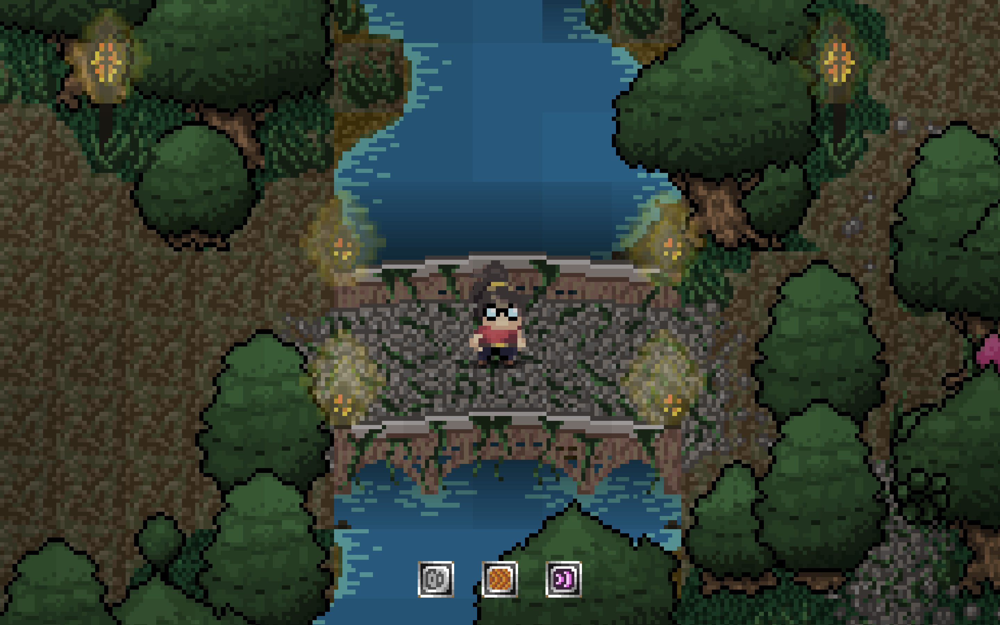
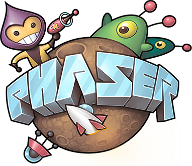
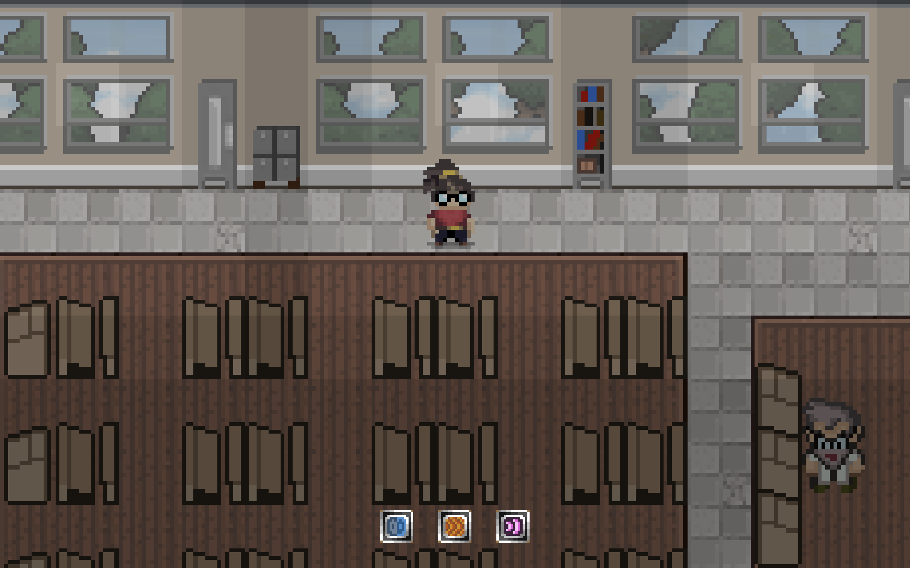

# 8-bit of bauhaus, My first game-dev journey | Part 1

- [General](#general)
- [Team](#team)
- [Project description](#project-description)
- [Solution](#solution)
- [First prototype](#first-prototype)

## General

At the moment I am studying at [Bauhaus University, Weimar][link_bauhaus]. A year ago I took a study project called "8-bit of Bauhaus". It was entirely dedicated to a game-dev. During the semester, the project participants in groups of 3 had to create a game (or at least a prototype). Although students were not limited in their choice of the genre of the game, the topic was more or less specific. The game should have something to do with Bauhaus University and its incredible history.

## Team

As I have already written, the team consisted of 3 people. We chose each other immediately, the team was formed during the first 15 minutes of first acquaintance of project participants.

Florian Batze is a graphic designer who was responsible for the appearance of our game. During development, he produced tons of high-quality graphics, sprites, animations, and layouts of levels.

Jacob Januar is the sound designer of our project. Jacob was responsible for everything related to sound effects, music and environmental sounds. An important part of Jacob's work was to adjust the audio track to the graphical representation of the world that we had. And in such a way that it felt appropriate, immersive, and not foreign.

Me as a programmer. I was responsible for all technical part and implementation of the project, development, delivery, and deploy.

## Project description

In the beginning there was a brainstorming. There were many different ideas and concepts in the team. At first, we wanted to create a platformer in which the main character would be a geometrical entity that combines "Röt", "Gelb", and "Blau". It was supposed that the essence would have different abilities when it took certain forms, and game mechanics would be adjusted to the current state of the entity. The idea was too obvious; other groups presented similar concepts in their first presentation.

We decided to change the paradigm and create something completely different. In search of a concept, we came to **dungeon crawler** with an orthogonal camera. During the discussion we agreed that our game would focus more on the adventure aspects of dungeon crawler than on grind. What's more, we decided to make it a **pixel art** style game. We thought it would add more recognizability and charm.

## Solution

The project had no restrictions on technology. The project curator advised everyone to take Unity as it is easy for beginners to learn. But I didn't want to take this piece of pie so easily, I needed something more complicated. Since I'm pretty good at JS, I decided to take it as a core for our game. Moreover, later on we chose the web as the main platform for our game.

After we decided on the platform, we started looking for a suitable game engine and found some suitable options:
- Self-written graphic engine based on HTML5 canvas (found very good [example][link_self_written_engine])
- Panda.js
- Phaser.js

When I compared all available engines and approaches, my choice fell on Phaser.js. At the time the project started, it had excellent documentation, community support and [many stars on Github][link_phaser]. It also had Typescript support, which was very important for me. In this kind of project, when you don't know how big it will grow, static typing is a huge bonus. Probably even cheat in some way.

## First prototype

When we finally decided on the game engine, I tried to find some suitable examples of its usage. Our preference was for examples of rogue-like games that were similar to our concept. Later I found [a great example][link_first_example], which we used as a basis for the whole project. In the end a lot of concepts from this example were taken directly or with modifications and used in the core of the game system.

Then I built an architecture based on this project. As it turned out **Phaser.js** does not give so many features out of the box. There are of course several different graphics pipelines, physics engine, sound engine, game scenes, and so on. But some elementary things like a layer system or behavioral system for game objects were missing. Plus in our case it was impossible to use the light system of Phaser.js, because of the limitations of the engine. In short, a lot of systems I had to write myself completely.

As a result, we ended up with the following list of functional solutions inside of the project:
- Level Management System
- Graphic layers system (background layer, character layer, top layer)
- Lighting System
- System for saving and downloading progress
- Combat system
- Dialogue system

Besides, a lot of work was done to implement common game solutions: NPC, doors (as triggers between scenes), sound subsystem, sprites animation subsystem. All this was created from scratch in a few months of hard work. In the next article I will tell more about the technology solutions that I have come up with and show how they work with the screenshots.

Also, I leave here the [Github link][link_game]. Come in, if anything

> 14.09.2020

<!-- ссылки -->
[link_bauhaus]: https://www.uni-weimar.de/de/universitaet/start/
[link_self_written_engine]: http://frankpoth.info/content/pop-vlog/javascript/2018/006-rabbit-trap/rabbit-trap.html
[link_phaser]: https://github.com/photonstorm/phaser
[link_first_example]: https://github.com/mipearson/dungeondash
[link_game]: https://github.com/sharadbrat/traumhaus
