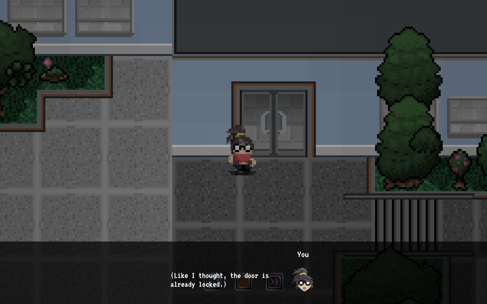
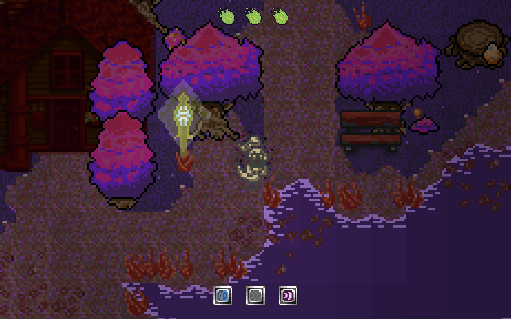

# 8-bit of bauhaus, My first game-dev journey | Part 2

In the previous article I have told about the 8 bit of bauhaus project and how it began. In this article we will magically move to the end of the project, and I will describe the details of the project and the technical decisions I have made.

- [Оболочка из React](#оболочка-из-react)
- [Команда](#система-уровней-слоёв-и-коллизий)
- [Графика: система освещения](#графика-система-освещения)
- [Графика: анимации и спрайты](#графика-анимации-и-спрайты)
- [Боевая система](#боевая-система)
- [Диалоговая система и GUI](#диалоговая-система-и-gui)
- [Звук](#звук)
- [Бонус: устройства ввода](#бонус-устройства-ввода)
- [Итог](#итог)

## React wrapper

At the moment when I started working on the game, I was heavily inspired by the **React** framework. I didn't consider it as a no-alternative choice, I had already tried to develop quite large-scale projects with Angular, had a great attitude to it and was quite satisfied with it. But I decided to use **React** in the first place because of academic interest. I was curious about the usefulness of this tool for the project which involved a separate rendering within a graphics engine, unusual input devices for web and game events. Among other things, I was looking for an opportunity to practice React.

I needed a framework like **React** for routing and GUI rendering. The task is small, but very important.

To summarize my experience with the framework - I didn't like it. React has no built-in DI, so that the simplest tasks like "refresh GUI and refresh GUI again in 10 seconds" had to be solved by a deep **props** propagation. Of course, I could have used additional tools, such as [redux-saga][link_redux_saga] to handle asynchronous operations, or to use [inversify][link_inversify] to implement DI, but I didn't have enough time to figure it all out and start using it effectively. If the framework had built-in DI, this problem wouldn't arise at all ([context][link_react_context] doesn't count, because it doesn't fully cover all the features of an IOC container).

## Levels, layers, collisions

To create a game world, you have to use some kind of toolkit. You can't just place objects in space through code; it's inconvenient and time-consuming. Instead, developers use scene editors or so-called tile editors. Traumhaus, by design, consisted of tiles, so I chose the [Tilemap editor][link_tilemap_editor] as a map editor.

Unfortunately, I could not use the file produced by the tool. So I wrote a little script that converted the tile map from the instrument format to the internal game format.

The format included several layers of tiles:

1. Background layers - are visually under the game objects,
2. Foreground layers - are visually above the game objects,
3. Collision layer - is not displayed, but necessary to make static game objects, through which the player cannot pass.

If you played **Traumhaus**, you could notice that when the ghost form is applied, not only the protagonist changes, but also the entire environment. To get such a smooth transition, it's not enough just to apply some filter to already existing environment, a custom approach is required. Our artist created separate tiles for the ghost world, and also created separate maps from the new tiles for each of the levels. As a result, we didn't just change all the colors of all the tiles when going to the ghost world, we dynamically changed each map and some individual tiles to make the picture look more natural. Technically, for each level we kept two instances of each of the layer sets described above.

I also encountered a problem with stitching the tiles during the export of the tilemaps: if the tile is rendered without antialiasing (a must for pixel art games), the user could see a gap between the two tiles when scaling or shifting the picture. As a solution, I used the technique of extruding the tiles: each tile in the tilemap was enlarged by 2 pixels on each side, repeating the pixels from the outermost row. In this way, when the tile was shifted by an incomplete pixel, the empty space between the pixels was filled with pixels from the extra row.

## Graphics: lightning system

Although [phaser][link_phaser] provides a lighting system, it was not suitable for our project. First of all, the lighting was too smooth and the game didn't look retro-like we wanted it to.

So I wrote my own mini-engine to render dynamic lighting (what a surprise). I got a lot of that from the system that **Michael Pearson** implemented in [his project](https://github.com/mipearson/dungeondash).

In general, the system can be described as follows: over each of the rendered tiles of the graphics we draw a black tile and manipulate its opacity depending on the degree of illumination. Illumination consists of three components: a given light for the level (we want it brighter outside, and darker in a cave), lighting around the player (also different for individual levels), lighting from light sources. Thus, when calculating the lighting intensity of each individual tile, we take each illumiination component and search for the brightest of them - it is taken as an inntensity of lighting of the tile.

## Graphics: animation and sprites

Once the layer rendering system was implemented, it was not so difficult to implement rendering of game objects. A separate rendering layer was created located between the background and the foreground. Each game object was then rendered on this layer.

It wasn't enough just to draw a sprite, it had to be animated. To animate game objects, a simple data structure was created so that the game engine could pull the necessary data from the original sprite (one image contained all the necessary graphics for one object). This data was then converted into the framework format and used by the framework for rendering. For the main character we used 5-9 frames per animation, for other game objects (enemies, items, npc) we made only 3-5 frames per animation to reduce production time.

## Combat system

The combat system in the game, although extremely simplified, is still quite complex and exciting. The player has three hitpoints, which regenerate over time. When colliding with enemies or their projectiles, the player loses 1 hitpoint. If the player dashes or fires a projectile at an enemy, the enemy dies. Since the enemies don't inhabit the human world, you can't fight in the human world.

Technically, we have a generic "enemy" class, from which all other enemy classes are inherited. These classes describe the behavior of each enemy. The locations and types of enemies on the level are also described in each level's data structure. When loading the level, we load all the enemies belonging to the level and that were not killed and spawn them in the game. After that the player can interact with them.

## Dialogue system and GUI

Dialogues are an important part of any action game. Dialogues are used to convey the plot, no matter how primitive it may be. Through dialogues, the characters are exposed. To be honest, we didn't work that hard on the dialogues, so we made them as simple as possible.

System: there are **NPCs** on the level, when player interacts with them - they a script is called. This script is written separately for each **NPC**. The body of the script specifies the conditions under which dialogues should be played. The dialogs are linear, they do not allow you to choose from a list of options. It is also worth noting that **NPCs** are static, they do not move or perform any actions.

Technically, every dialog uses the same **GUI** layer from the **React**, to which we supply them with certain data through the service. The data is taken from the dialog's settings, which are set in the configuration of the layer. Here I'd like to express my love for the web platform for how flexible and extensible it is. It makes it fairly easy to combine tools from different paradigms (graphical game engine **Phaser** + web application framework **React**) to achieve any goal.

## Sound

You can't create a rich and memorable atmosphere without a high-quality sound design. We were lucky enough to have a talented person on our team who did his job 100% and created amazing music and sound effects that fit the game's atmosphere perfectly. As with the visuals, the music, too, had to be made in two versions per level. One version for the physical world, the other for the ghost world.

Some work was also done on recording the sounds of the street and nature. You can hear them on every level.

And, of course, sound effects: the sounds of blows, footsteps, flying projectiles, etc.

## Bonus: input devices

Since the demo stand for our game was a tube TV and a retro gamepad, and I certainly did not want to debug in such an environment, at first I created 2 versions of the game (keyboard control and gamepad control), and then I even added support for touch devices.

Gamepad support in a web platform is a pain. This testbed helped me a lot with debugging: [https://gamepad-tester.com/](https://gamepad-tester.com/)

## Summary

As a result of the project, we got a rather simple and short, but very lively and interesting game in retro stylistics. The combination of "minimalistic gameplay", pixel-based graphics and cheap-tune sound produced the exact effect we wanted.

As with any time limited project, we didn't bring to life all of the ideas we had in mind at the beginning. But it would be wrong to say that we didn't do enough. In fact, we did a huge amount of work to make the project come to life.

I'm glad I had this experience in my life: to create a game in a semester as a class project. It's a cool experience and I'm grateful to the people who made it possible.

Thank you, Nikolai Alexandrovich, for teaching me how to code.

I will also leave here a [link to Github][link_game].

> 09.01.2022

<!-- ссылки -->
[link_phaser]: https://github.com/photonstorm/phaser
[link_first_example]: https://github.com/mipearson/dungeondash
[link_game]: https://github.com/sharadbrat/traumhaus
[link_inversify]: https://github.com/inversify/InversifyJS
[link_redux_saga]: https://redux-saga.js.org/
[link_react_context]: https://reactjs.org/docs/context.html
[link_tilemap_editor]: https://www.mapeditor.org/
