# Greece 2020

- [General](#general)
- [Hotel and city](#hotel-and-city)
- [What to do](#what-to-do)
- [What to eat](#what-to-eat)
- [Lessons](#lessons)

## General

August 2020. Me and my beloved decided to go to Greece for vacation, breathe fresh air, swim in the sea. We did not expect to have any vacation because of the corona. We thought that traveling these days is dangerous. It appeared that we overthought and statistics for Greece were encouraging. In the end, we found [russian-speaking tour agency][link_valeria] in Erfurt and used their help.

As the result for long process of descision and many conversations with tour agency we came up with Greece. In particular, we chose small tourist city Georgioupoli on Crete island (19.08 - 26.08).

## Hotel and city

We searched for a long time for convenient accomodation, and finally we found [Zorbas Hotel][link_zorbas] ([location][link_zorbas_location]). This is small three star apart hotel owned by family of locals in the center of the city. Staff is friendly, food is very good, steps are taken against pandemics (antiseptics, breakfast was served by an individual instead of regular buffet, masks were worn). For breakfast they serve fresh vedgetables and fruits, eggs, beacon, bread, different sorts of jelly, flakes, and of course coffee. For dinner it is safe to order meat dishes, and seafood, and vegeterian/vegan food. Portions are gigantic and we often have been upset about the fact that we've had to leave half-eaten plate of food.

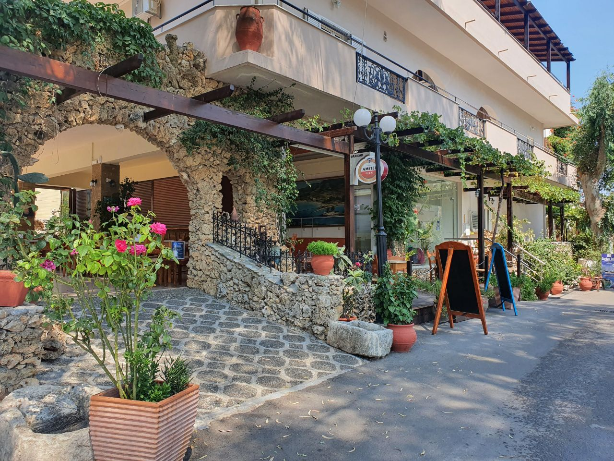

The room is pretty common for the apart-hotel: double bed, refrigerator, toilet with shower, mini-kitchen, TV, air-conditioning. Everything is fine, even though furniture has looked a bit used and old, it have been convenient in general. The only thing - we've had to hack the air-conditioning in order to have some comfortable sleep. The room service is carried out once in 3 days, service is fine.

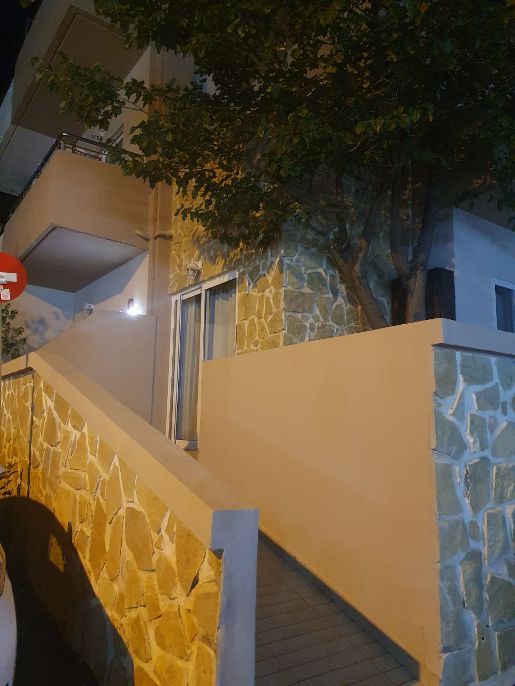

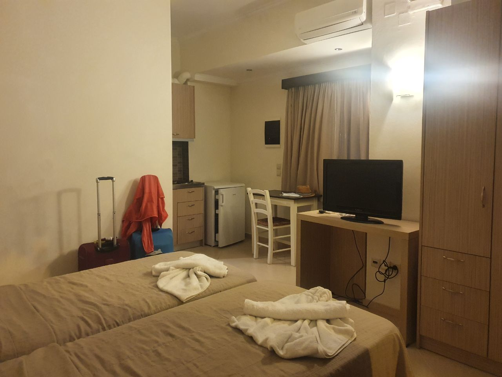

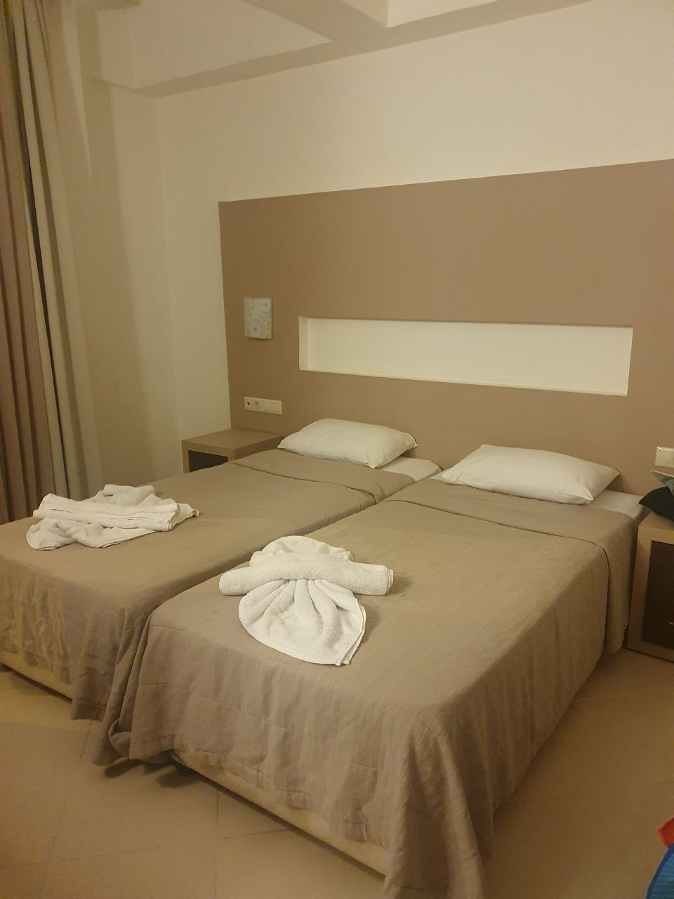

Beach is very close, about 150 meters. Most of the people are hanging out on the [nearest beach][link_main_beach], also water is the warmest there. Beach is in untidy condition, but it is okay to swim there. Also it is possible to find nice shadowed spot without paying for sunbed: next to the church pier under trees.

To the east there is [clean and spare beach][link_east_beach], but we've had to walk around 500 meters to get there.

One more [beach][link_west_beach] is located in the western part of the city. We've had to cross the bridge in order to get there. There is very convenient spot under a tree, frankly speaking.

In the city there are all the facilities: farmacy, grocery shop, laundry, car, boat, skooter, and bike rent, cafes and restaurants.

## What to do

### Georgioupoli

**[Church on the pier][link_church_georgioupoli]** - is tremendous place and symbol of the city. To enter the church, you need to come by path made of boulders starting from western part of the middle beach. The way is difficult because the boulders are placed high in relation to the sea and it is easy to get wet from tides when it is windy. Anyway, when you are there you can get some marvelous view of the city and surrounding mountains and of course the church. Inside of it you can find place of energy. Small quiet room with few icons in there creates the atmosphere of harmony.

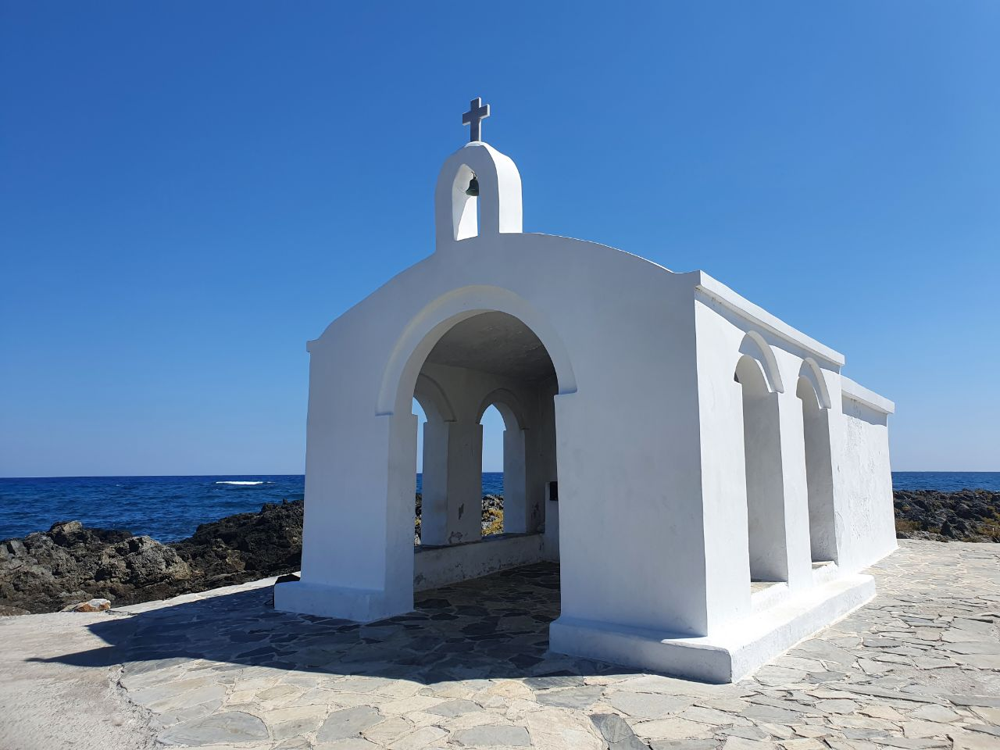

**[Catamarans in turtle river][link_katamorani]** - someone might say that this is for old people and my answer to that is yes, you fool, that is the point! In short, there are bunch of locals under the bridge that lease catamarans and canoes for calm river trips. On the river you might see flock of geese and turtles. It is funny and calm, no stress but kind of small adventure. There is always shadow because the river is pretty narrow and has bamboo forests on both of its shores. Anyway, you still would like to put sunscreening on. The river itself and surrounding nature are magical, water is transparent and you can see the bottom of the river and its inhabitants. Duration of the whole trip is around an hour. I doubt some might need more time on that, because pushing catamaran under the sun can be pretty exhausting. It costs 5 euro per person per hour.

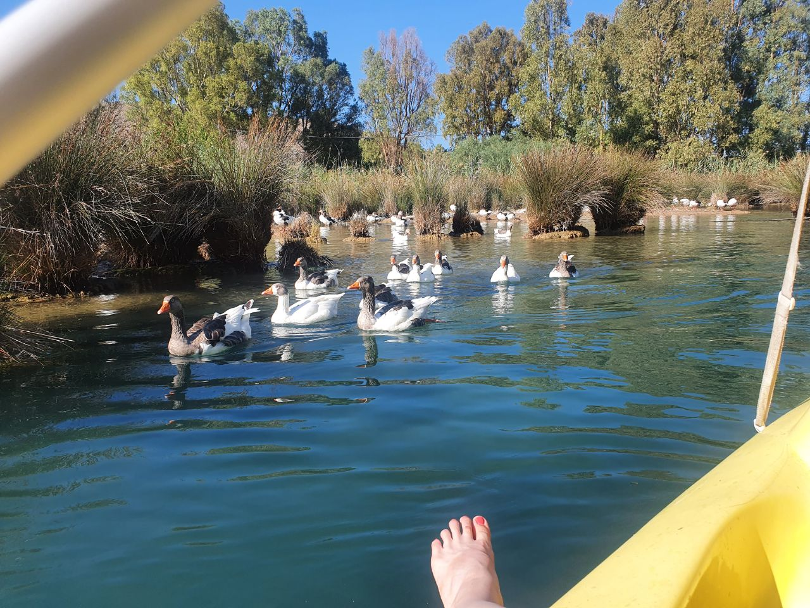

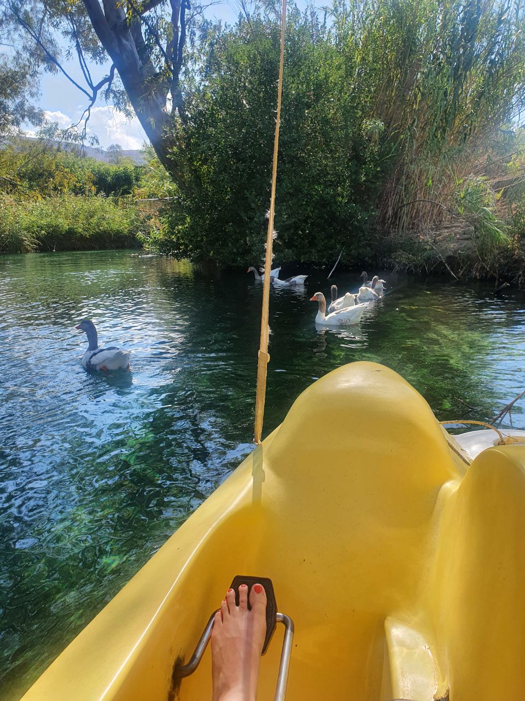

**[ATV ride][link_safari]** - must visit. In the center of Georgioupoli there is a small booth with car park next to it (just in front of Zorbas hotel). All this stuff is called Georgioupolis safari. We were met there by charming and a bit annoying person named Harris, he knows many languages and speaks very fluently. They offer some cool things, trips to different beaches and mountains of Crete island. I was interested in ATV ride. We thought this through many times and decided that I would go alone as a passsenger. Luba worried about me and I wanted to smooth out her feelings. Firstly, I felt regret that I didn't drove on my own, but then Teo the instructor offered me to smoke a sigarette during the ride and then I realised that it was an absolute chill. I was just sitting on this ATV and looked at surrounding nature and beauties of the Crete island mountains.

During the trip you pass by several small villages, through the mountainous terrain, on the roads. If you are lucky, Theo takes a group to look at a small [church inside the mountain][link_safari_church]. This cannot be called a church: a small room in a cave, a couple of icons, a water source. place of energy.

The trip as a result turned out to be absolutely not extreme, but very impressive. If you ride with an instructor, you drive in front of the column, which means that no dust will fly on you, you can smoke, tear off pears on the move and eat them, and he will tell you about all sorts of places, animals, the way of the locals. I would advise you to ride with an instructor, but of course you can also go for ATV as a driver. In that case you should definitely take someone, because there is something to shoot there, and when you drive, you can't do that. It lasts 4 hours, there are 2 options - to go in the morning at 8.30, and in the evening at 16.00. The price - 60 euros for the driver and 40 euros for the passenger, for the two of us were offered to ride with a discount for 90 euros.

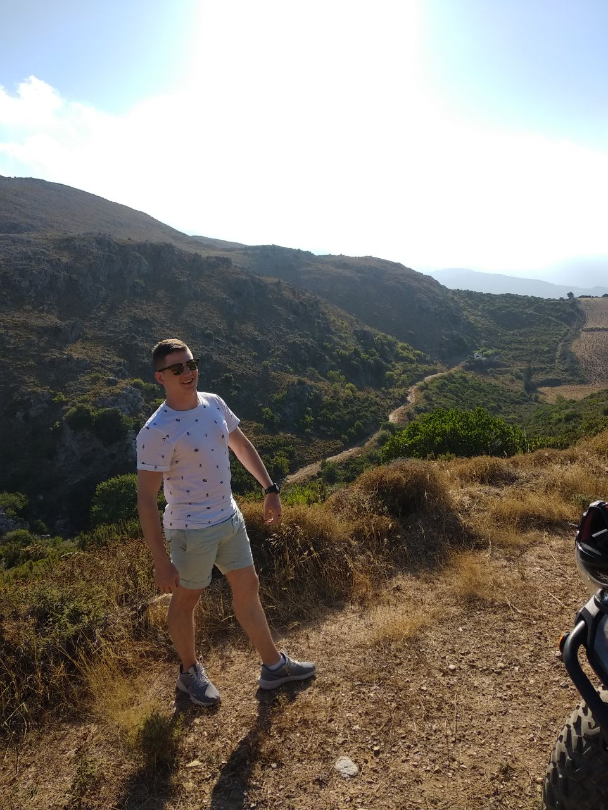

**[Mini Golf][link_minigolf]** - 17 holes, it takes about an hour to complete. Pension vacation, but if you treat it with a gag, it is fun. It costs 3 euros per person per day.

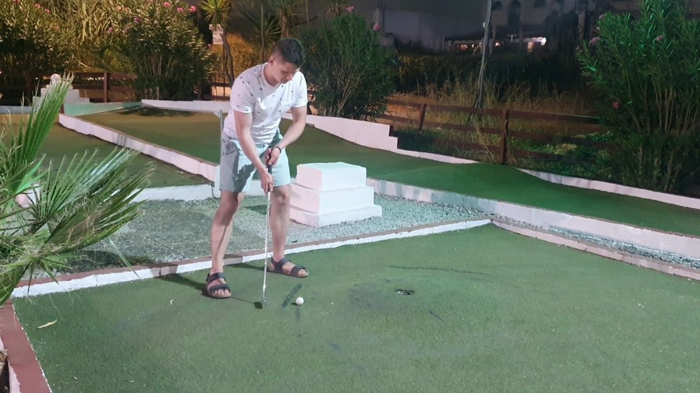

**[Concerts][link_concerts]** - in the evenings, local musicians play concerts in Georgioupoli. It's nothing special, two guys play instruments (jazz pipe and synthesizer), one of them sings. The tracks are mixed, can play Greek music (maybe even traditional, IDK), can play our favorite 90's disco, macarena and stuff like that. In general, it's quite fun, we almost always danced.

### Rethymno

**[The secret church in the rock][link_church_retimno]** - is an extraordinary place of energy, we accidentally came across it when we were looking for access to the fortress. This unremarkable cave inside turned out to be an amazingly beautiful hidden church. Feels like it hides from the whole world under a huge rock. We do not know how it got there yet, but I suspect it has a very interesting story. Be sure to visit, such places are very rare on our planet, the church is really hidden, not calling for tourists, just stand there in peace and quiet.

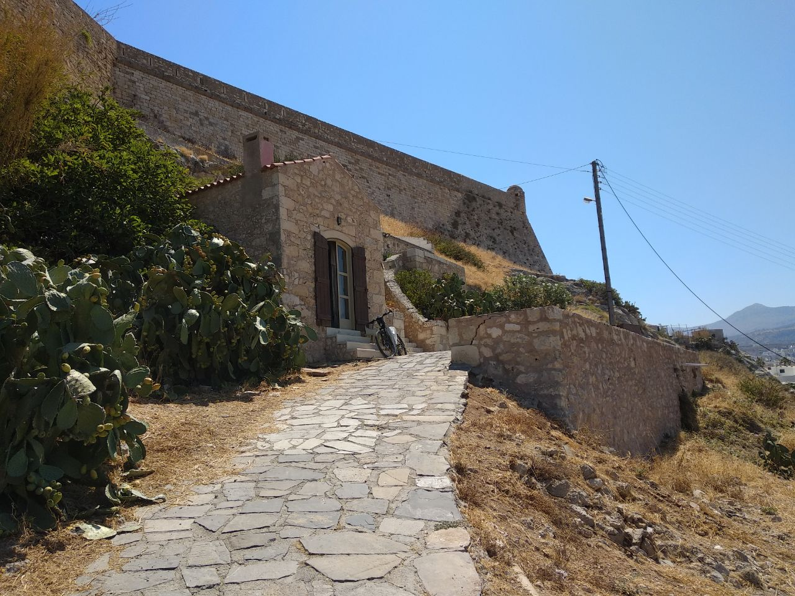

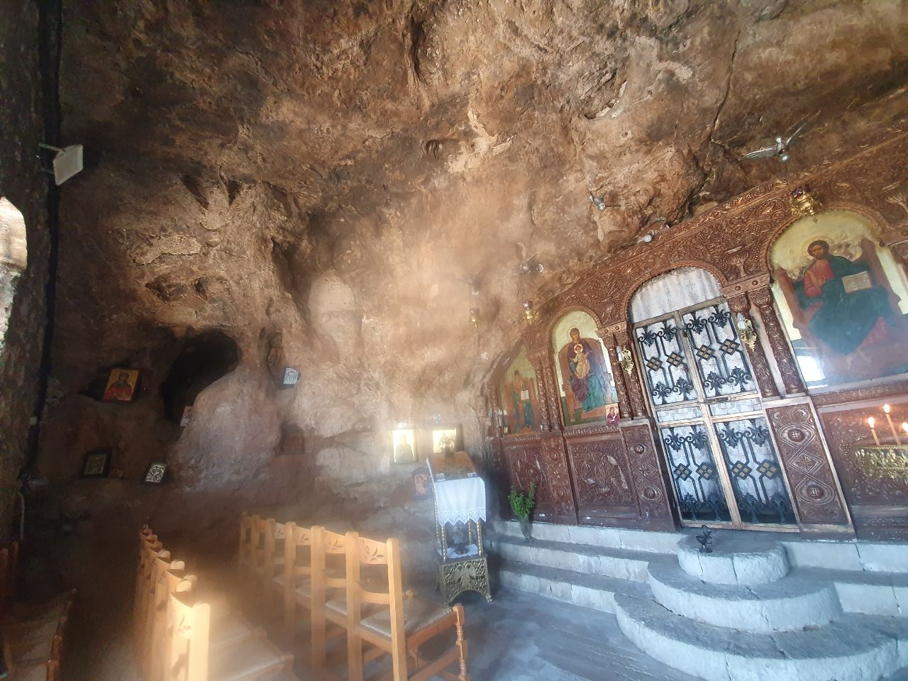

**[Fortress][link_castle_retimno]** - a giant fortress built by the Venetians in the Middle Ages, destroyed and rebuilt by the Turks, used by the Germans and finally restored by the Greeks. The fortress is located on a high rock, so its towers offer beautiful views of the city and the sea. There is not much to see inside the fortress. Pile of ruins, with its history, but still nothing impressive. This is a great place to go for a walk, to stretch your legs and shake the fat, carefully acquired in taverns. The entrance costs 4 euros per person, inside there is a store with snacks and a souvenir store, in total the trip will take 2-3 hours.

**[Irish pub][link_irish_pub]** - it was surprising to find such a beautiful Irish pub in the center of Rethymno. We were attracted by the interior of this bar. It was filled with various gimmicks and souvenirs from all over the world. We were met by a nice bartender from South Africa, we had a drink (me - beer, Luba - soft mojito), had a chat with her and went further.

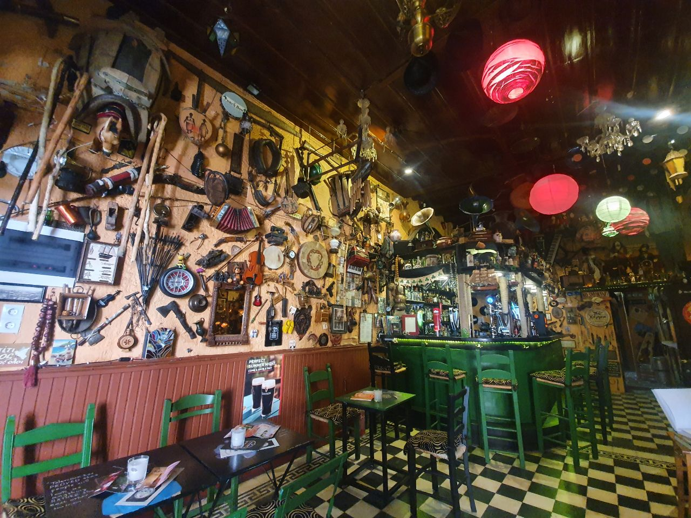

### Leipzig (bonus)

**[Belantis][link_belantis]** - a nice amusement park, we had enough for 4-5 hours. The park is [outside the city of Leipzig][link_belantis_location], you need to make 2 transfers to get there. Because of the pandemic in the park was not so many people, so even the biggest roller coaster had a line of no more than 15 minutes, which can not fail to please. We expected that there would be a lot of roller coasters for very young kids and a couple of big attractions. As a result, it was the other way round, and most of the attractions were huge. Fun and exciting.

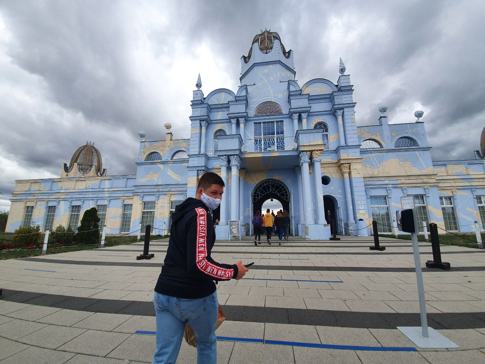

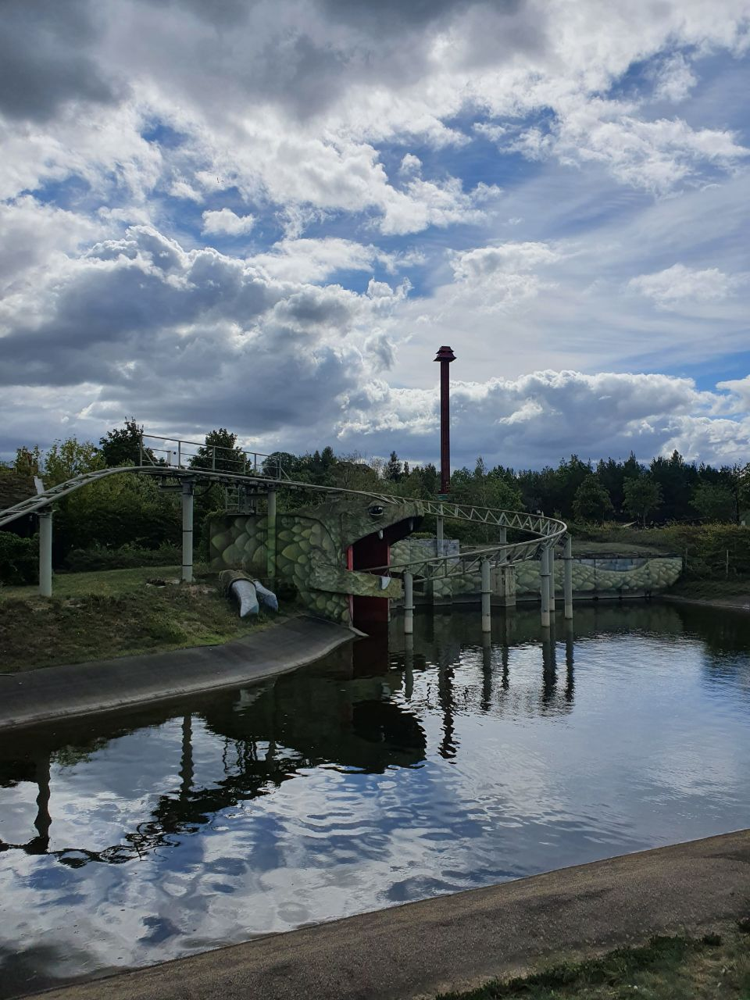

## What to eat

**[Taverna Arkadi][link_arkadi]** - is the best restaurant of Georgioupolis, I officially declare. The view is just perfect, the food is very tasty, portions are good, fresh seafood, the price is average. Be sure to visit.

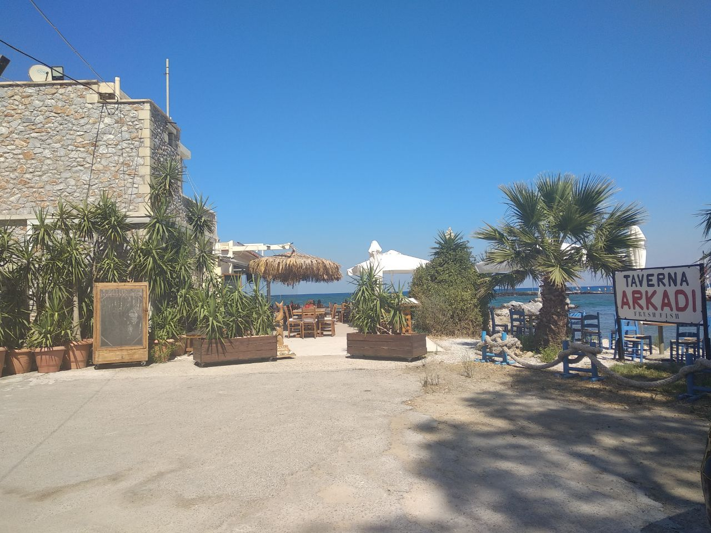

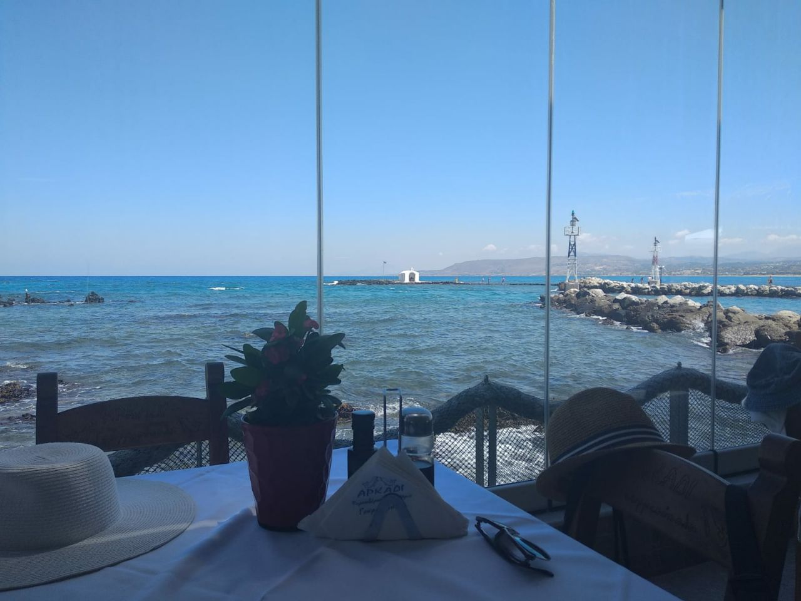

**[Gyropolis][link_gyropolis]** - is a small bistro on the central square. It is notable for the fact that it is a typical representative of Greek fast food. There is a dish that can be briefly described as "Greek shawarma", called Gyros. At this place, you can eat this dish quite tasty, along with Greek salad. It is worth a try. The food is very simple and tasty (fast food), prices are very low. It is optional to visit.

**[Taverna Zorbas][link_zorbas]** - Yes, we ate here every day, but the dishes are great! Plus the price is quite decent, friendly staff.

**[Sun Light Taverna][link_sun_light_taverna]** - шf after swimming in the sea you want to have a quick bite to eat, and you are not willing to go to [Arcadi][link_arkadi], you can go to this place and eat seafood. Good service, delicious seafood. I would recommend the octopus and fried squid.

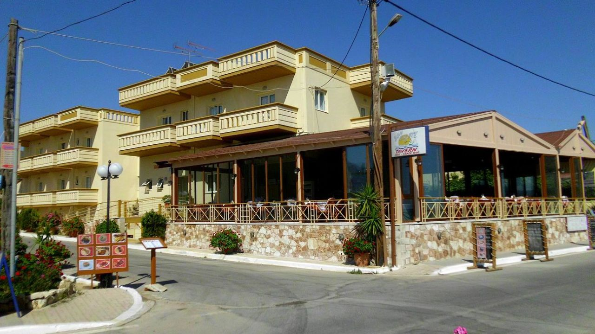

## Lessons

- **Cover 100% of your body with sunscreen** - Anointed with sunscreen, but still managed to get burned. Just didn't anoint my legs. What a fool. For couple of days it was painful to walk, had to use panthenol. Then it certainly went away, but I still felt bad.
- **Calculate the amount of sunscreen** - took too little (one tube), had to buy one on the spot, and it is not cheap there (14.50 euros, Carl).
- **Wear new shoes before vacation** - Luba bought sandals and wore them exactly once before the trip and rubbed them with blisters. She did not wear new sandals on the trip.

> 29.08.2020

<!-- links -->
[link_valeria]: https://atlas-tour.de/

[link_zorbas]: https://www.holidaycheck.de/hi/hotel-zorbas/f50e7028-12f3-3614-9074-3268e38f559c
[link_zorbas_location]: https://goo.gl/maps/fcjevpc424z867mw9
[link_main_beach]: https://maps.app.goo.gl/JDST2W9Wyvuz2yb78
[link_west_beach]: https://maps.app.goo.gl/DaM2JjvpNTf8skyQ6
[link_east_beach]: https://maps.app.goo.gl/JaGZCk9Pvv1N8miAA

[link_church_georgioupoli]: https://maps.app.goo.gl/3cnNmQamajkuhXbaA
[link_katamorani]: https://goo.gl/maps/KKBc7gPNCbSKFaJp8
[link_safari]: https://maps.app.goo.gl/DctfMmitstXnwRc97
[link_safari_church]: https://maps.app.goo.gl/VKz6DEvsoJRszFUq7
[link_minigolf]: https://goo.gl/maps/iNGbri5kDLhUBR6r6
[link_concerts]: https://goo.gl/maps/pdUFKrAi6ZHb1srM6

[link_church_retimno]: https://maps.app.goo.gl/kutRu3J1ounEdNPLA
[link_castle_retimno]: https://maps.app.goo.gl/PWLM2h1cK2C8kMzs8
[link_irish_pub]: https://maps.app.goo.gl/hM4MqynLue1g8jVK7

[link_belantis]: https://www.belantis.de
[link_belantis_location]: https://goo.gl/maps/fyqbJ8qLTFBmeSHg7

[link_arkadi]: https://g.page/arkadi-fish-taverna-georgioupo?share
[link_gyropolis]: https://goo.gl/maps/RmLRSSdVCGDDQynPA
[link_sun_light_taverna]: https://maps.app.goo.gl/5ezgiJhGppy8ryTs5
