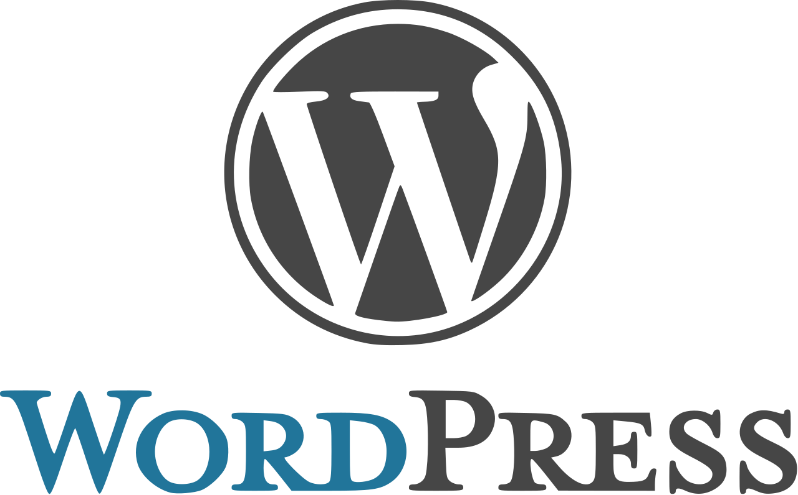

# Опыт с Wordpress

Недавно я попробовал использовать WordPress в одном проекте. В этой статье я бы хотел поделиться своим опытом по имплементации проекта, положительными и отрицательными моментами.

## Описание проекта

Проект представлял собой контентный веб сайт, посвященный Московскому Петанк клубу. Мы работали в небольшой команде с UX/UI [Ларой Сорокиной](https://mobile.twitter.com/wid0ki) и проектным менеджером. Воркфлоу был следующий: ПМ осуществлял коммуникацию с клиентом и предоставлял функциональные требования, на их основе Лара составляла адаптивный дизайн веб-сайта.

После того, как я получил дизайн выполненный в *Sketch*. Так как я привык к удобству работы с *Figma*, я импортировал исходный файл из другого редактора. Так мне было проще узнавать точные расстояния между элементами, параметры типографики, цвета и другие элементы дизайн системы.

В конце концов, у нас был дизайн для следующих страниц:
* Лендинг - главная страницы сайта;
* Информация о клубе - контактная информация и информация о федерации петанка;
* Турниры - информация по текущим и прошедшим турнирам;
* Тренироввки - форма для заявки на тренировку;
* Инвентарь - список товаров, которые можно проибрести оффлайн.

Когда объем работ был понятен, функциональные требования определены, а детали по предпочтительному техническому решению выяснены, я решил использоввать CMS с настраиваемой темой. WordPress идеально подходил для этой задачи.

## WordPress

[WordPress](https://wordpress.org/) это опенсорсная CMS написанная на PHP. Сначала я думал взять [KeystoneJS](https://keystonejs.com/) как CMS, потому что она ближе по технологиям к тому, что я лично предпочитаю больше - *node.js* и *javascript*. Но в действительности, WordPress это топ 1 CMS на рынке уже больше десяти лет и она имеет лучшую поддержку от сообщества. Для меня это было очень важно, чтобы разработанная система была управляемой и масштабируемой, изменяемой в будущем и удобной для клиента. Вот почему WordPress это лучший выбор в данной ситуации.

Главная проблема с WordPress для меня, это отсутствие какого-либо опыта работы с ней. Но спасибо платформе, ее очень просто изучить. В интернете есть множество обучающих видеокастов, куча статей. Кроме того, у WordPress очень крутая документация.

Вот что я сделал по шагам:
1. Сверстал статическую версию сайта на HTML, CSS (SCSS) и JS ([demo](https://moscow-petanque.netlify.com));
2. Изучил основы WordPress за день, запустил "hello world" блог, чтобы понять, как именно работает платформа;
3. Настроил проект используя CMS, перенес в проект все свои наработки из статического сайта, создал отдельную тему;
4. Отрегулировал WordPress, чтобы удовлетворить бизнес-потребности проекта;
5. Включил плагины для ленты Instagram, форм, кастомных полей для кастомных сущностей и пр.;
6. Финализировал проект, под нужды клиента.

Вот ссылка на работающую версию, которая в данный момент управляется клиентом: [https://mospetanque.ru/](https://mospetanque.ru/).

## Почему мне зашёл WordPress

Во первых, мне понравилось работать с WordPress из-за его простоты. Всё, что мне нужно было сделать это загрузить архив с собранным движком, положить его в директорию веб-сервера и запустить конфигурационный процесс в браузере.

Конечно, мне пришлось настроить конфигурацию для разработки и продакшена, создать отдельную тему и настроить иерархию файлов. Но в любом случае, это было в несколько раз меньше работы, чем я мог бы сделать с кастомным решением или CMS, с которыми я уже имел опыт работы к моменту реализации проекта.

Во вторых, мне понравилась настройка плагинов внутри движка. Их очень просто использовать и настраивать под свои нужды. Это буквально мета-программирование с помощью мышки. Нажать на установку, скопировать строчку на страницу и та-да, полностью настраиваемаялента Instagram, включающая в себя функции ленивой и полной подгрузки, кастомных фоллбеков и пр.

## Почему мне не зашёл WordPress

Я считаю, PHP - устаревший инструмент. Я имею в виду, что он полезен для своих целей, в 2005 не было так много альтернатив чтобы реализовать динамический веб-сайт, но в 2019 действительно есть куда больше возможностей, начиная с обычного SPA и заканчивая SSR на JS. Сейчас PHP должен быть использован только лишь с WordPress. В противном случае, движок может оказаться тормозом прогресса.

Вторая вещь, которая мне не понравилась в WordPress это настройка сущностей, которое происходит на уровне PHP кода. Я думаю это ограничение в движке было создано с целью облегчения миграций сайтов на WordPress. Мне не нравится идея созранения сущностей на уровне кода, потому что это порождает кучу бойлерплейт кода и лишает администратора сайта создавать сущности через админ-панель.

## Итог
Принимая все во внимание, я хотел бы сказать, что WordPress идеально подходит для некоторых нужд, как в моем примере, для веб-сайта организации, который включал новостной блок, онлайн-шоппинг и множество разных страниц, которые должны быть просты для редактирования.

> 27.06.2019
