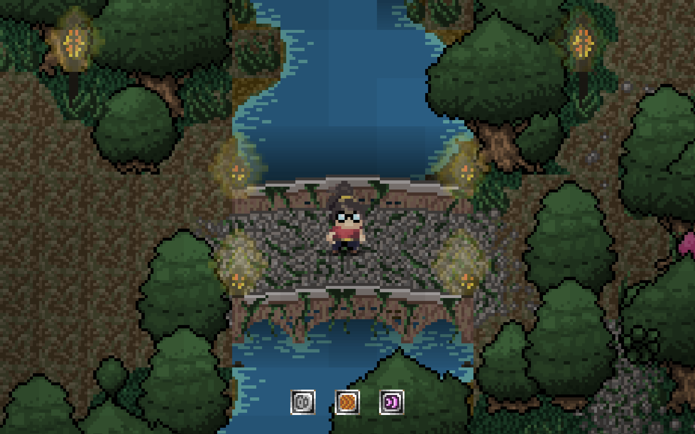

# 8-bit of bauhaus, Мое первое путешествие в гейм-дев | Часть 1

- [Общее](##общее)
- [Команда](##команда)
- [Описание проекта](##описание-проекта)
- [Решение](##решили-сделать-игру-на-javascript)
- [Первый прототип](##первый-прототип)

## Общее

В данный момент я учусь в [Университете Bauhaus, Веймар][link_bauhaus]. Год назад я взял учебный проект, который назывался "8-bit of Bauhaus". Он был полностью посвящен гейм-деву. В течение семестра участники проекта в составе групп из 3-х человек должны были создать игру (или хотя бы прототип). Хотя студенты не были ограничены в выборе жанра разрабатываемой игры, тема была более или менее конкретной. Игра должна быть как-либо связана с университетом Баухаус и его невероятной историей.

## Команда

Как я уже написал, команда состояла из 3-х человек. Мы выбрали друг друга буквально сразу, команда была сформирована за первые 15 минут знакомства участников проекта.

Florian Batze - графический дизайнер, человек отвечающий за внешний вид нашей игры. Во время разработки он выдавал тонны высококачественной графики, спрайтов, анимаций и лейаутов уровней.

Jacob Januar - саунд дизайнер нашего проекта. Jacob был ответственнен за все, что было как либо связано со звуковыми эффектами, музыкой и звуками окружения. Важной частью работы Jacob'а являлась подгонка аудио трека к графическому представлению мира, которое было у нас. Причем таким образом, чтобы это чувствовалось подходящим, иммерсивным и не чужеродным.

Я - программист. Я был ответственнен за всю техническую часть и техническую реализацию проекта, разработку, доставку и деплой.

## Описание проекта

В начале был брейншторминг. В команде было много разных идей и концептов. Сначала, мы хотели создать платформер, в котором главным персонажем была бы геометрическая сущность, в которую объединены "Röt", "Gelb" и "Blau". Подразумевалось, что сущность имела бы разные способности, если бы она принимала те или иные формы, а игровые механики подстраивались бы под текущее состояние. Идея оказалась слишком очевидной, другие группы представили подобные концепты на первой презентации.

Мы решили поменять парадигму и создать что-то совершенно иное. В поисках концепции мы остановились на **dungeon crawler** с ортогональной камерой. В ходе обсуждения мы договорились что наша игра будет нацелена более на приключенческие аспекты dungeon crawler'ов, нежели на гринд. Более того, мы решили делать игру в стилистике **pixel art**. Мы посчитали, что это добавит ей больше узнаваемости и шарма.

## Решили сделать игру на Javascript

Проект не имел никаких ограничений по технологиям. Куратор проекта советовал всем взять Unity, так как она легка для освоения новичкам. Но я не захотел брать этот кусок пирога так просто, мне нужно было что-то посложнее. Так как я доволно хорошо владею JS, я решил взять его в качестве кора для нашей игры. Более того, впоследствии мы выбрали веб как основное окружение для игры.

После того как мы определились с платформой, мы начали искать подходящий игровой движок и нашли несколько подходящих вариантов:
- Самописный графический движок, основанный на HTML5 canvas (нашел очень хороший [пример][link_self_written_engine])
- Panda.js
- Phaser.js

Сравнив все имеющиеся движки и подходы, мой выбор пал на Phaser.js. На момент начала имплементации проекта у него была отличная документация, поддержка сообществом и [много звезд на Github][link_phaser]. Также у него присутствоввала поддержка Typescript, что было очень важно для меня. В такого рода проектах, когда ты не знаешь, насколько масштабным он вырастет, статическая типизация является огромным бонусом. Наверное, даже читом в каком-то плане.

## Первый прототип

Когда мы наконец определились с игровым движком, я попробовал найти какие-нибудь подходящие примеры его использования. Наиболее предпочтительными для нас являлись примеры rogue-like игр, которые бы имели схожую с нашей концепцию. Позже я нашел [великолепный пример][link_first_example], которой и был использован нами в качестве базиса для всего проекта. В конце концов, очень много концепций из данного примера были взяты напрямую или с модификациями в кор игровой системы.

Далее, я построил архитектуру, основанную на данном проекте. Как оказалось, **Phaser.js** не дает так много функций из коробки. Там конечно есть несколько разных графических пайплайнов, и физический движок, звуковой движок, игровые сцены и прочее. Но некоторые элементарные вещи, такие как система слоев или поведенческая система для игровых объектов отсутствовали напрочь. Плюс в нашем случае нельзя было использовать свветовую систему Phaser.js, из-за ограничений движка. Короче говоря, большое количество систем мне пришлось полностью писать самому.

В результате мы пришли к такому списку функциональных решений внутри проекта:
- Система управления уровнями
- Система графических слоёв (фоновый слой, слой персонажей, верхний слой)
- Система освещения
- Система сохранения и загрузки прогресса
- Боевая система
- Диалоговая система

Кроме того, была проделана большая работа по внедрению общеигровых решений: NPC, двери (как триггеры между сценами), звуковая подсистема, подсистема анимаций спрайтов. Всё это было создано с нуля за несколько месяцев упорной работы. В следующей статье я подробнее расскажу о тех технологических решениях, к которым я пришел и продемонстрирую их работу на скриншотах.

Также оставлю здесь [ссылку на Github][link_game]. Ты это, заходи, если че.

> 15.09.2020

<!-- ссылки -->
[link_bauhaus]: https://www.uni-weimar.de/de/universitaet/start/
[link_self_written_engine]: http://frankpoth.info/content/pop-vlog/javascript/2018/006-rabbit-trap/rabbit-trap.html
[link_phaser]: https://github.com/photonstorm/phaser
[link_first_example]: https://github.com/mipearson/dungeondash
[link_game]: https://github.com/sharadbrat/traumhaus
