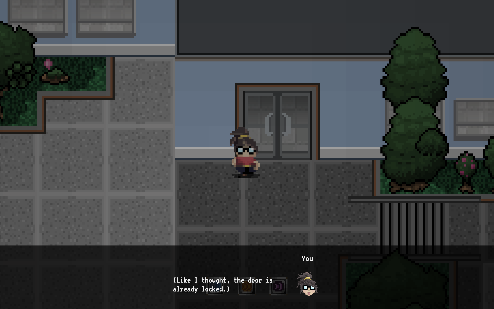
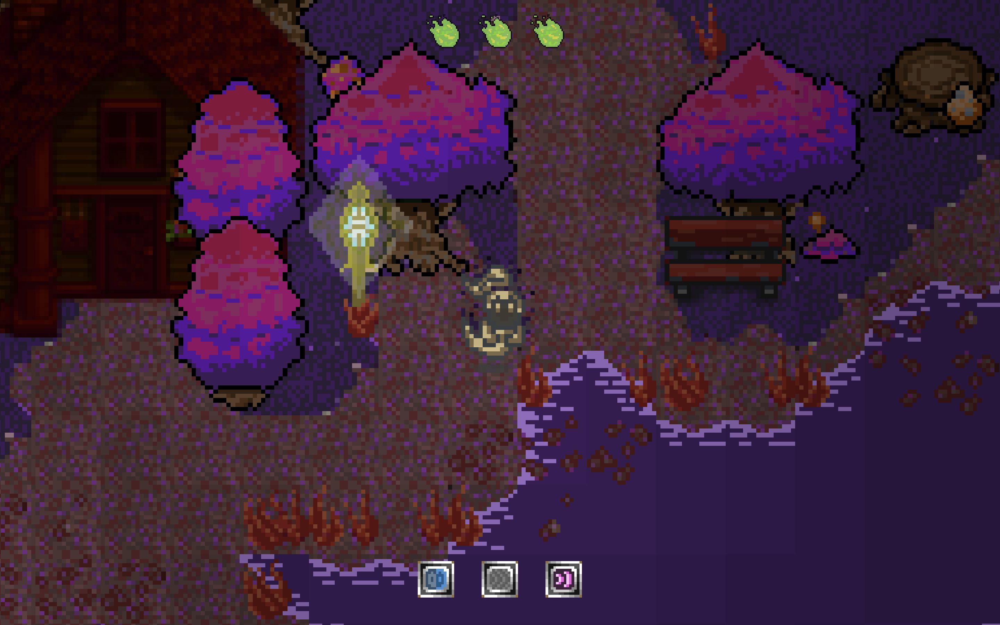
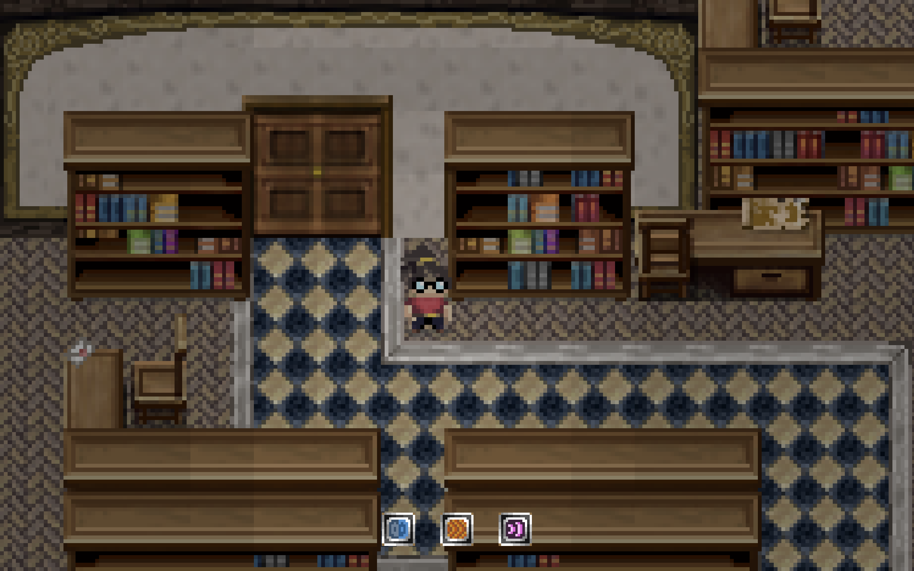
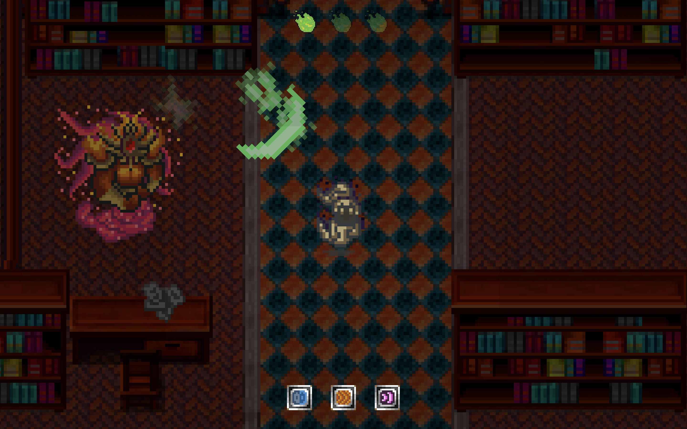
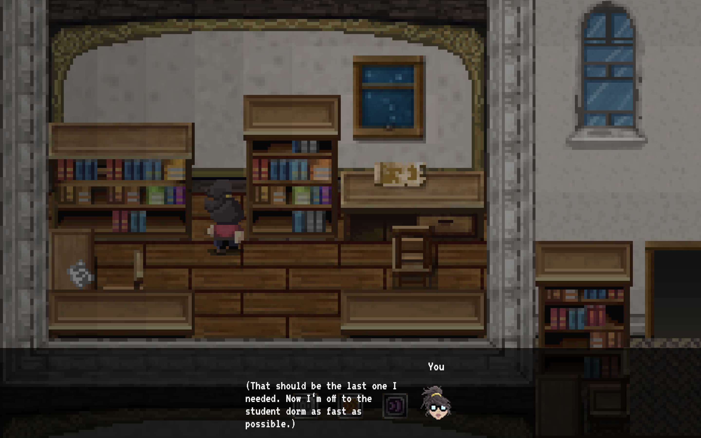

# 8-bit of bauhaus, Мое первое путешествие в гейм-дев | Часть 2

В предыдущей статье я рассказал о проекте 8 bit of bauhaus и как он начинался. Сейчас же, мы по волшебству перенесемся к его концу, и я расскажу в формате ретроспективы о деталях реализации проекта и принятых мною технических решений.

- [Оболочка из React](#оболочка-из-react)
- [Команда](#система-уровней-слоёв-и-коллизий)
- [Графика: система освещения](#графика-система-освещения)
- [Графика: анимации и спрайты](#графика-анимации-и-спрайты)
- [Боевая система](#боевая-система)
- [Диалоговая система и GUI](#диалоговая-система-и-gui)
- [Звук](#звук)
- [Бонус: устройства ввода](#бонус-устройства-ввода)
- [Итог](#итог)

## Оболочка из React

К моменту начала создания игры я был сильно вдохновлён фреймворком **React**. Я не считал его безальтернативным выбором, я уже пробовал писать достаточно масштабные проекты на Angular, прекрасно относился к нему относился и был им весьма удовлетворен. Но попробовать использовать именно **React** я решился в первую очередь из-за академического интереса. Мне было любопытно, насколько удобно будет пользоваться этим инструментом в рамках проекта, в котором задействованы обособленный рендеринг внутри графического движка, нестандартные для веб-платформы устройства ввода и игровые события. Кроме всего прочего я искал возможность попрактиковаться в React.

Фреймворк типа **React** мне был необходим для роутинга и отрисовки GUI. Задача небольшая, но очень важная.

Резюмируя свой опыт от использования фреймворка - мне не понравилось. В React нет встроенного DI, из-за чего простейшие задачи вроде "обновить GUI и через 10 секунд снова обновить GUI" приходилось решать через пробрасывание **props** на неопределенную глубину. Конечно, можно было бы задействовать дополнительные инструменты, например использовать [redux-saga][link_redux_saga] для обработки асинхронных операций, или взять [inversify][link_inversify] для реализации DI собственными силами, но времени на то чтобы разобраться со всем этим и начать эффективно этим пользоваться не было. Если бы во фреймворке был встроенный DI, то подобной проблемы не возникало бы в принципе ([context][link_react_context] не в счёт, так как не в полной мере выполняет обязанности IOC-контейнера).

## Система уровней, слоёв и коллизий

Чтобы создать игровой мир, надо использовать некоторый инструментарий. Нельзя просто размещать объекты в пространстве через код, это неудобно и затратно по времени. Вместо этого разработчики используют редакторы сцен или так называемые редакторы тайлов. **Traumhaus** по своей задумке состояла как раз из тайлов, поэтому для нее был выбран [Tilemap editor][link_tilemap_editor].

К сожалению у меня не получилось использовать готовый файл, который отдавал инструмент. Поэтому я написал небольшой скрипт, который преобразовывал карту тайлов из формата инструмента во внутренний формат игры.

Формат подразумевал наличие нескольких слоёв тайлов:

1. Слои заднего фона - находятся визуально под игровыми объектами
2. Слои переднего фона - находятся визуально над игровыми объектами
3. Слой коллизий - графически не отображается, но необходим для составления статических игровых объектов, через которых игрок не может пройти

Если читатель играл в **Traumhaus**, он должно быть заметил, что в игре при переходе в форму призрака меняется не только протагонист, но и все окружение. Чтобы получить такое гладкое изменение, не достаточно просто наложить какой-нибудь фильтр на уже существующие тайлмапы, нужен индивидуальный подход. Художник создал отдельные тайлы для мира призраков, а также создал отдельные карты из новых тайлов для каждого из уровней. В результате при переходе в мир призраков мы не просто меняли все цвета всех тайлов, мы динамически изменяли каждую карту и некоторые отдельно взятые тайлы, чтобы картинка выглядела более правдоподобной. Технически, для каждого уровня мы хранили по два экземпляра каждого из наборов слоёв, описанных выше.

Также при экспорте тайлмап я столкнулся с проблемой сшивания тайлов: если тайл отрисовывается без сглаживания (для игр в стиле пиксель арт это обязательно), то при масштабировании или смещении картинки пользователь мог увидеть зазор между двумя тайлами. В качестве решения я использовал технику расширения (extruding) тайлов: каждый тайл в tilemap увеличивался на 2 пикселя с каждой стороны, повторяя пиксели из крайнего ряда. Таким образом при смещении тайла на неполный пиксель, пустое пространство между пикселями заполнялось пикселями из дополнительного ряда.

## Графика: система освещения

Хотя [phaser][link_phaser] и предоставляет систему освещения, она не подошла для нашего проекта. Во-первых, освещение получалось слишком плавным, игра выглядела недостаточно ретрообразной, как мы хотели.

Поэтому я написал свой мини-жвижок для отрисовки динамического освещения (вот это неожиданность). Я многое позаимствовал из системы, которую реализовал **Michael Pearson** в [своём проекте](https://github.com/mipearson/dungeondash).

В общих чертах систему можно описать так: над каждым из отрисованных тайлов графики мы рисуем черный тайл, и манипулируем его прозрачностью в зависимости от степени освещения, которая состоит из трех составляющих: заданное освещение для уровня (мы хотим, чтобы на улице было ярче, а в пещере - темнее), освещение вокруг игрока (также различается для отдельных уровней), освещение от источников света. Таким образом, при вычислении интенсивности освещения каждого отдельного тайла, мы берем каждую компоненту освещения и ищем самую яркую из них, - она и берется за показатель интенсивности освящения тайла.

## Графика: анимации и спрайты

После того, как была реализована система послойного рендеринга окружения, внедрить рендеринг игровых объектов было не так уж и сложно. Был создан отдельный слой отрисовки, находящийся между задним и передним планом. Далее каждый игровой объект отрисовывался на этом слое.

Мало просто отрисовать спрайт, его нужно анимировать. Чтобы выполнить задачу анимации игровых объектов, была создана простая структура данных, с помощью которой игровой движок доставал нужные данные из исходного спрайта (одно изображение содержало всю необходимую графику для одного объекта, то есть один и тот же объект с каждым кадром анимации). Далее эти данные преобразовывались в формат фреймворка и использовались уже фреймворком для отрисовки. Для главного персонажа мы использовали 5-9 фреймов на анимацию, для остальных игровых объектов (враги, предметы, npc) мы сделали только по 3-5 фреймов на анимацию, чтобы сэкономить на времени производства.

## Боевая система

Боевка в игре хоть и крайне упрощённая, но всё же довольно сложная и захватывающая. У игрока есть 3 жизни, которые восполняются со временем. При столкновении с противниками или их снарядами, игрок теряет 1 жизнь. Если игрок делает деш или выпускает снаряд в противника, - противник погибает. Так как противники не обитают в мире людей, то и драться в мире людей нельзя.

Технически, мы имеем общий класс "противник", от которого наследуются вс остальные вражеские классы. В них описано поведение каждого противника. Расположение и типы противников на уровне также описаны в структуре данных каждого уровня. При загрузке уровня мы выгружаем всех не убитых противников, которые есть на уровне и создаем их на карте, после чего игрок может с ними взаимодействовать.

## Диалоговая система и GUI

Диалоги это важная часть любой адвенчуры. Через диалоги подается сюжет, какой бы примитивный он ни был. Через диалоги раскрываются персонажи. Скажу честно, над диалогами мы работали не так интенсивно, и сделали их настолько простыми, насколько это было возможным.

Система: на уровне стоят **NPC**, каждый из них при взаимодействии вызывает скрипт. Этот скрипт прописывается отдельно для каждого **NPC**. В теле скрипта указывается при каких условиях какой диалог стоит проиграть. Диалоги линейны, в них отсутствует возможность выбора ответа. Также стоит отметить, что **NPC** статичны, они не двигаются и не совершают никаких действий.

Технически каждый диалог использует тот самый **GUI** слой из, находящийся в **React**, в который мы подаем определенные данные через сервис. Данные берутся из настроек диалога, которые установлены в конфигурации уровня. Здесь я бы хотел выразить свою любовь к веб-платформе за то, насколько она гибкая и расширяемая. Она позволяет довольно легко совмещать инструменты из разных парадигм (графический игровой движок **Phaser** + фреймворк для создания веб-приложений **React**) для достижения любых целей.

## Звук

Невозможно создать живую и запоминающуюся атмосферу без качественного звукового дизайна. Нам повезло и в команде у нас был талантливый человек, который выполнил свою работу на 100% и создал прекрасные музыку и звуковые эффекты, которые идеально подходили под сеттинг игры. Как и в ситуации с графикой, музыку тоже нужно было изготавливать по 2 версии на уровень. Одна версия для физического мира, другая для мира призраков.

Была проделана некоторая работа и по записи звуков улицы, природы. Их можно услышать на каждом из уровней.

Ну и конечно же звуковые эффекты: звуки ударов, шагов, летящих снарядов, и пр.

## Бонус: устройства ввода

Так как демо стенд для нашей игры представлял собой ламповый телевизор и ретро геймпад, а отлаживать в таком окружении я конечно же не хотел, я создал сначала 2 версии игры (управление на клавиатуре и управление на геймпаде), а потом и вовсе добавил поддержку сенсорных устройств.

Поддержка геймпада в веб-платформе это боль. Этот стенд мне очень сильно помог в отладке: [https://gamepad-tester.com/](https://gamepad-tester.com/)

## Итог

По результатам проекта получилась довольно простая и короткая, но очень живая и интересная игра в ретро стилистике. Сочетание "минималистичного геймплея", пиксельной графики и cheap-tune звука произвело именно тот эффект, которого мы добивались.

Как и в любом проекте, ограниченном по времени, мы не воплотили в жизнь все идеи, которые задумывали в начале. Но будет неправильно сказать, что мы сделали недостаточно. Напротив, мы проделали колоссальную работу чтобы реализовать проект.

Я рад что у меня в жизни был такой опыт: создать игру за семестр в качестве учебного проекта. Это клевый опыт и я благодарен людям, которые сделали это возможным.

Спасибо, Николай Александрович, за то что научили меня программировать.

Также оставлю здесь [ссылку на Github][link_game].

> 09.01.2022

<!-- ссылки -->
[link_bauhaus]: https://www.uni-weimar.de/de/universitaet/start/
[link_phaser]: https://github.com/photonstorm/phaser
[link_first_example]: https://github.com/mipearson/dungeondash
[link_game]: https://github.com/sharadbrat/traumhaus
[link_inversify]: https://github.com/inversify/InversifyJS
[link_redux_saga]: https://github.com/inversify/InversifyJS
[link_react_context]: https://github.com/inversify/InversifyJS
[link_tilemap_editor]: https://www.mapeditor.org/
