# Греция 2020

- [Общее](##общее)
- [Отель и город](##отель-и-город)
- [Что поделать](##что-поделать)
- [Что покушать](##что-покушать)
- [Уроки](##уроки)

## Общее

Август 2020. Мы с моей любимой решили поехать отдыхать в Грецию, подышать свежим воздухом,
поплавать в море. В этом году мы уже не рассчитывали на какой-либо отпуск, все-таки
разгар пандемии. Мы считали путешествие в такие времена очень опасным. Выяснилось,
что мы надумали, статистика по Греции была довольно хорошей. В конце концов, мы нашли
[русскоговорящее турагентство][link_valeria] в Эрфурте, и обратились к ним.

В результате долгих переговоров с турагентом мы пришли к Греции, а точнее к небольшому
туристическому городку Георгиоуполис (Georgioupoli) на острове Крит (19.08 - 26.08).

## Отель и город

В результате долгих поисков подходящего жилья, наш выбор пал на отель [Zorbas][link_zorbas]
([геолокация][link_zorbas_location]). Это небольшой 3-звездочный апарт-отель в центре города,
им владеет семья местных. Персонал приветливый, кормят очень хорошо, принимаются меры против
пандемии (антисептики, завтрак подается отдельным человеком вместо общего шведского
стола, носятся маски). На завтрак гора свежих фруктов, яйца, бекон, хлеб,
разнообразные варенья, хлопья и конечно кофе. На ужин можно заказать и мясные блюда,
и морепродукты, и вегетарианские блюда. Порции очень большие, частенько приходилось
со слезами на глазах оставлять наполовину съеденную тарелку.

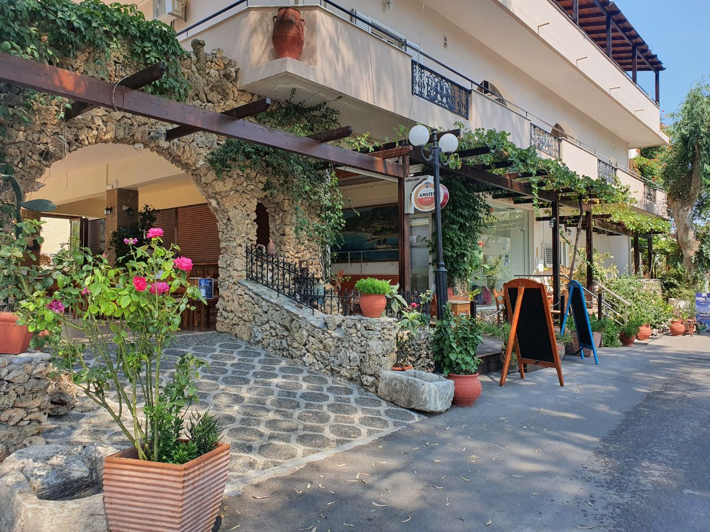

Комната самая стандартная для апарт-отеля: двойная кровать, холодильник, туалет с душем,
мини-кухня, телевизор, кондиционер. Все вполне прилично, хотя на мебели видны какие-то
потертости и следы сервиса, в целом было комфортно. Единственнный момент - пришлось
подшаманить с кондиционером чтобы была возможность комфортно спать. Убираются раз в 3
дня, сервис отличный.

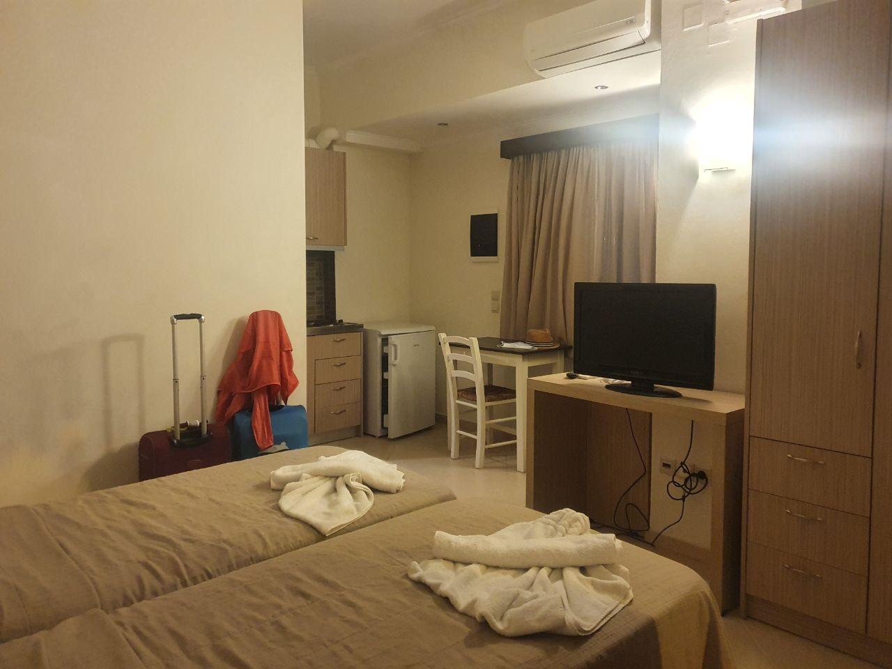

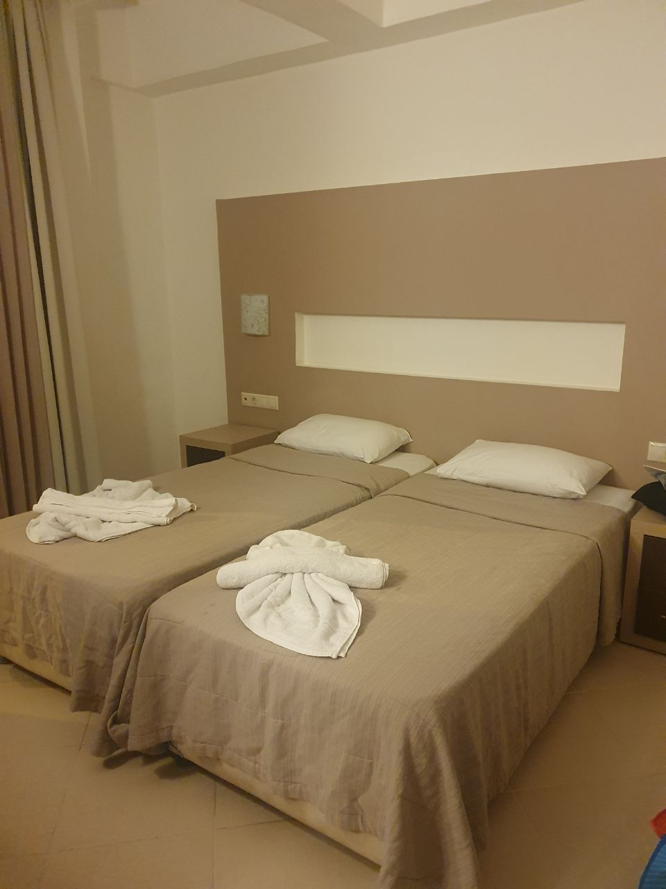

Пляж совсем близко, около 150 метров. На ближайшем [пляже][link_main_beach] очень
много народа, но и вода самая теплая. Пляж в неопрятном состоянии, но купаться можно,
есть вариант лечь в тень без лежака, ближе к пирсу к церкви на пляже есть деревца.

Ближе к востоку есть более [свободный пляж][link_east_beach], до него придется
пройтись около 500 метров.

Еще один [пляж][link_west_beach] находится в западной части города, нужно будет
перейти мост, чтобы до него добраться, также можно найти тень под деревом,
вполне приличный спот, между прочим.

В городе есть все для удобства: аптека, супермаркет, прачечная, аренда авто, лодок,
скутеров и байков, кафешки и рестораны.

## Что поделать

### Георгиоуполис

**[Часовня на пирсе][link_church_georgioupoli]** - это живописное место, является
символом города. Чтобы попасть в эту небольшую часовню, нужно
пройти по камням от западного края центрального пляжа. Путь нелегкий, ведь камни
находятся на небольшой высоте от моря, и в ветренную погоду можно здорово намочиться от волн.
Зато по прибытии можно наблюдать великолепный вид на город, на окружающие его горы и
на саму церквушку. Внутри можно найти место силы, тихая темная комната, с нескольмкими
расположившимися внутри иконами, которая создает атмосферу покоя в момент,
когда ты в нее входишь.

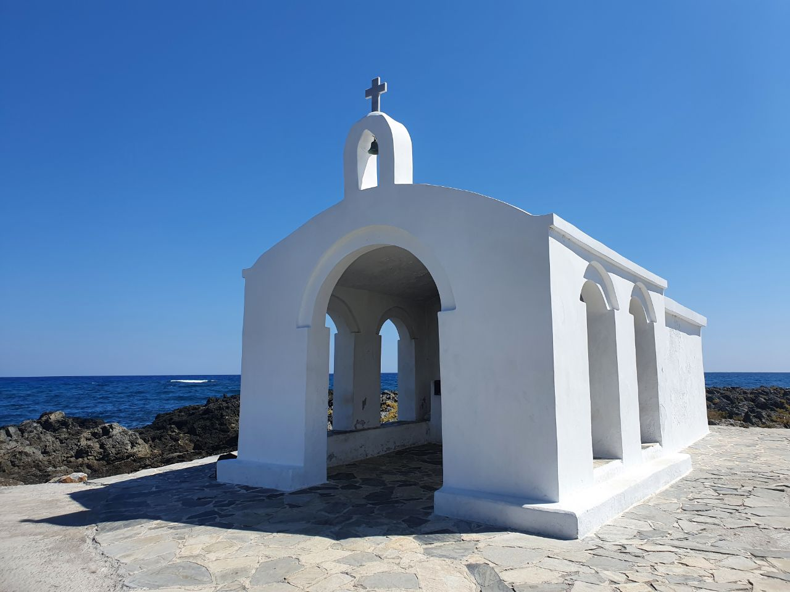

**[Катамараны в черепашьей реке][link_katamorani]** - кто-то может сказать что это
пенсионерский отдых, и я ему отвечу - да, болван, ты прав, в этом и смысл. Если
коротко, есть под мостом местные люди, которые сдают в аренду катамараны и каноэ для
спокойной поездки по реке. На реке можно наблюдать стаю гусей, а также речных черепах.
Это прикольно, не экстремально, но тоже своего рода приключение. От того, что река
неширокая и по берегам ее растут бамбуковые деревья, постоянно присутствует тень,
но кремом все же намазаться стоит. Конечно же сама река и окружающая природа просто
волшебны, вода прозрачная, отчетливо видно дно реки, её обитатели. Длится вся поездка
около часа, сомневаюсь, что кому-либо потребуется больше времени, по жаре ехать на
катамаране против течения достаточно утомительно. Стоимость -  5 евро на человека в час.

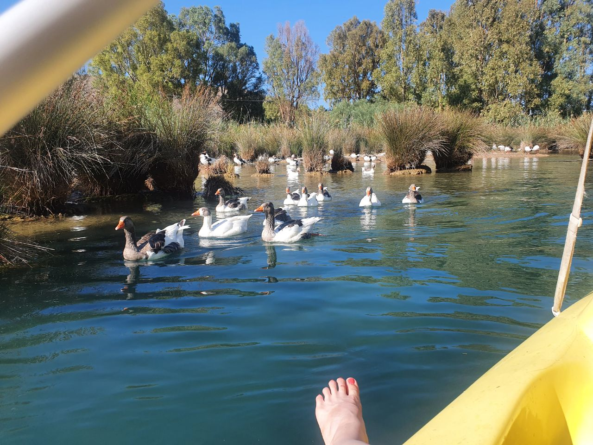

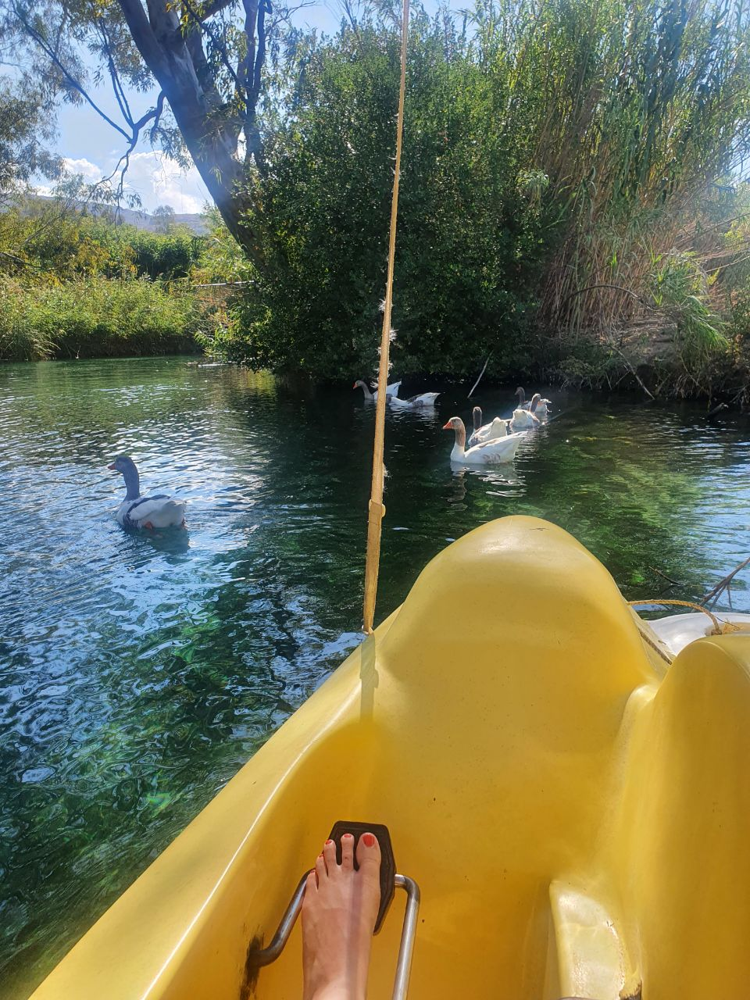

**[Поездка на квадроцикле][link_safari]** - обязательно к посещению. В центре города
есть небольшая будка и прилегающий к ней автопарк (прямо у отеля Zorbas). Все это
называется Georgioupolis safari. Там нас встретил надоедливый, но все же довольно
обаятельный человек по имени Harris, он знает множество языков, отлично убалтывает.
Они предлагают много всего, поездки на разные пляжи и горы острова Крит. Мой интерес
завоевала поездка на квадроциклах. Долго мы думали, и в результате я поехал один,
причем не в качестве водителя, а в качестве пассажира к инструктору. Я так поехал,
потому что Люба очень переживала за меня и я хотел как-то сгладить её переживания.
Поначалу я жалел, что не поехал как водитель, но потом инструктор по имени Тео предложил
мне закурить на ходу, и тут я понял, что это тотальный чилл, и что лучше варианта
уж быть не может. И так оно и оказалось, я просто ехал, наблюдал красоты деревенской
жизни местных и окружающую их природу, при этом вообще не запариваясь.

В течение поездки проезжаешь мимо нескольких маленьких деревень, по горной местности,
по дорогам. Если ты везучий, то Тео отвозит группу посмотреть на небольшую
[церквушку внутри горы][link_safari_church]. Это нельзя назвать церковью: маленькая
комнатушка в пещере, пара икон, источник. Место силы.

Поездка в результате оказалась совершенно не экстремальной, но очень впечатляющей. Если
ехать с инструктором, то ты едешь впереди колонны, а значит на тебя не летит пыль, ты
можешь курить, срывать груши на ходу и кушать их, а также он будет рассказывать тебе обо
всяких местах, животных, укладе местных жителей. Я бы советовал ехать с инструктором,
но можно конечно и на отдельном квадроцикле, в качестве водителя, но обязательно надо
брать кого-нибудь, ведь снимать там есть что, а когда ты ведешь, ты особо не поснимаешь.
Длится это все 4 часа, есть 2 варианта - поехать утром в 8.30, и вечером в 16.00. Цена -
60 евро за водителя и 40 за пассажира, за двоих нам предлагали проехаться
со скидкой за 90 евро.

**[Минигольф][link_minigolf]** - минигольф он и в африке минигольф. 17 лунок, обходятся
примерно за час. Пенсионерский отдых, но если к нему относиться с задором и небольшим
кеком, то это весело. Стоит это удовольствие 3 евро на человека за день.

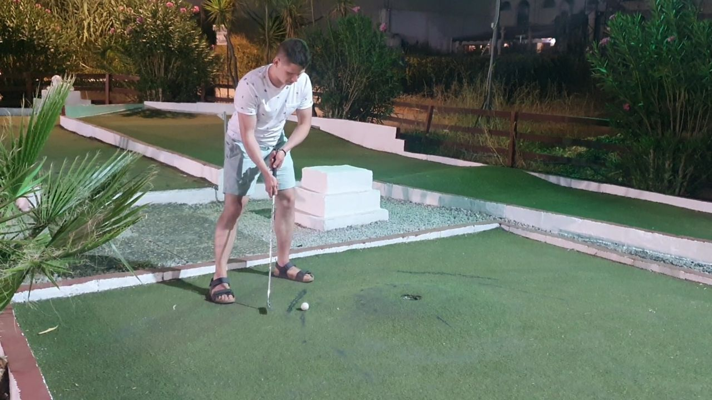

**[Концерты][link_concerts]** - по вечерам в Георгиоуполисе играются концерты местными
музыкантами. Ничего особенного, два парня играют на инструментах (джаз-труба и синтезатор),
один из них поёт. Треки смешанные, то поиграют греческую музыку (может даже традиционную,
но мы хз), то поиграют нашу любимую дискотечку 90-х, макарену и все в таком духе. В целом,
довольно весело, мы почти всегда танцевали.

### Ретимно

**[Секретная церковь в скале][link_church_retimno]** - необычайное место силы, мы
случайно на него наткнулись, когда искали подступ к крепости. Это ничем не примечательная
снаружи пещерка внутри оказалась удивительно красивой потаенной церквушкой, которая как
бы скрывается ото всего мира под огромною скалой. Нам пока не известно, как она там
оказалась, но, подозреваю, история у нее очень интересная. Обязательно к посещению,
такие места являются очень редкими на нашей планете, церковь действительно потаенная, не
зазывающая туристов, просто стоит себе, существует в тишине и покое.

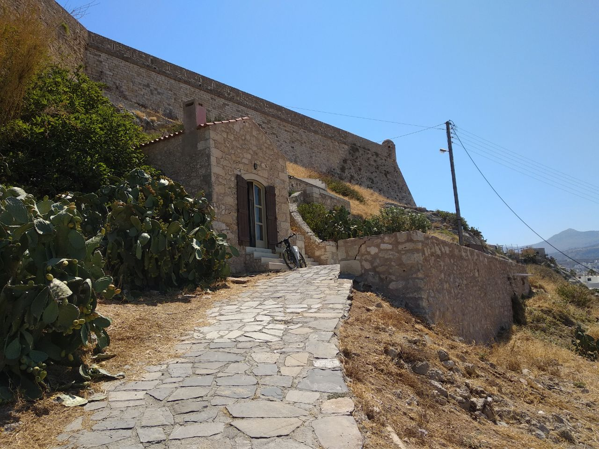

**[Крепость][link_castle_retimno]** - гигантская крепость, построенная венецианцами
в средневековье, разрушенная и вновь отстроенная турками, использованная немцами
и наконец отреставрированная греками. Крепость находится на высокой скале, поэтому
с башен её открываются прекрасные виды на город, море. Внутри крепости смотреть особо
не на что. Куча развалин, со своей историей, но все же ничем не впечатляющих. Это
отличное место, чтобы походить-погулять, чтобы размять ноги и встряхнуть жирок,
старательно приобретенный в тавернах. Вход стоит 4 евро на человека, внутри есть
магазин со снеками и сувенирный магазин, в общей сложности путешествие займет 2-3 часа.

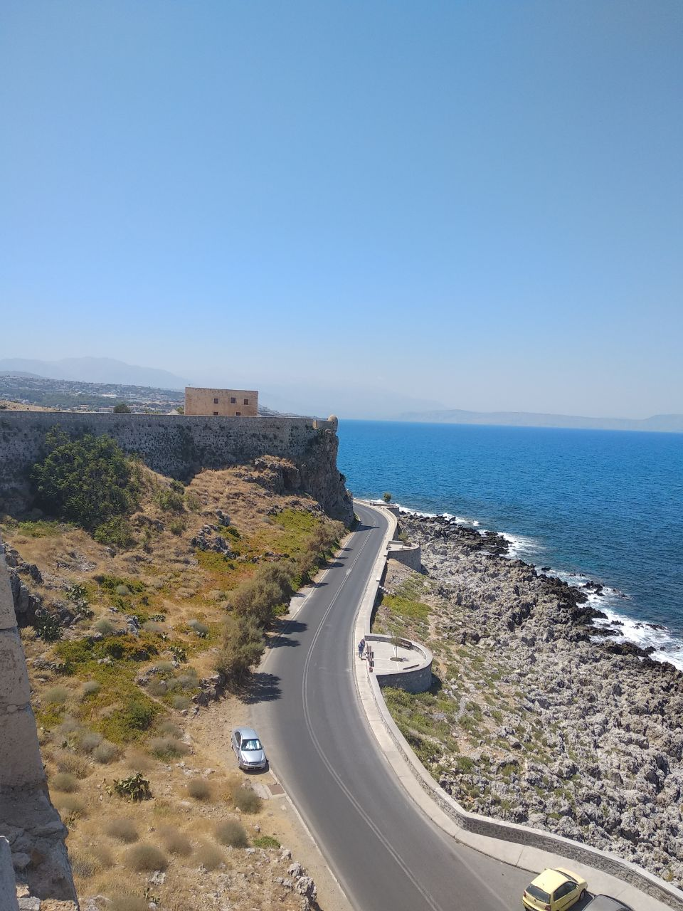

**[Ирландский паб][link_irish_pub]** - это было неожиданно, найти такой прекрасный
ирландский паб в центре Ретимно. Нас привлек интерьер этого бара. Он был усеян разного
рода прибамбасами, сувенирами со всего мира. Нас встретила милая барменша, родом из
Южной Африки, мы выпили по напитку (я - пиво, Люба - безалкогольный мохито), поболтали
с ней и пошли дальше.

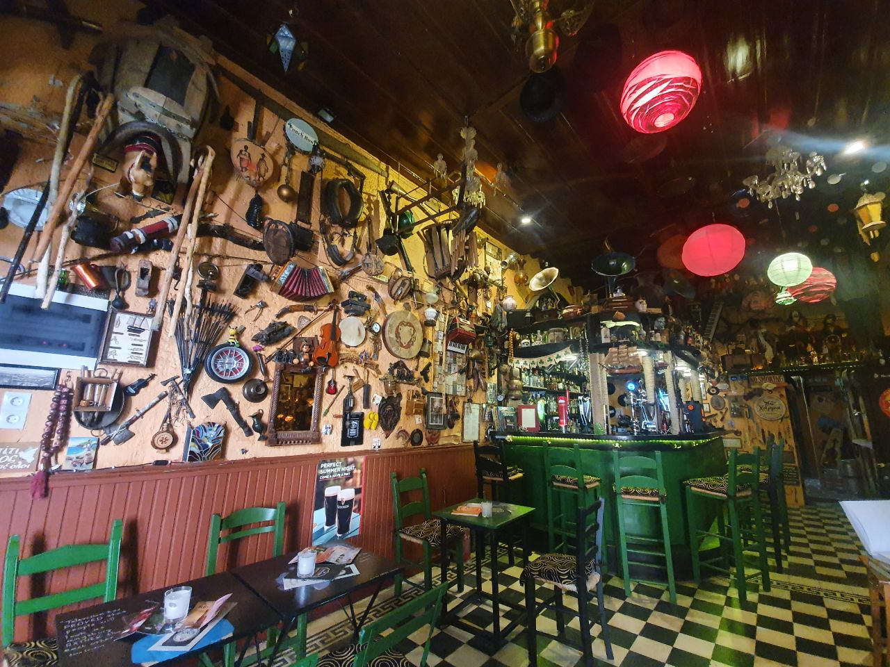

### Лейпциг (бонус)

**[Белантис (Belantis)][link_belantis]** - хороший парк развлечений, нас хватило
на 4-5 часов. Парк находится [за городом Лейпциг][link_belantis_location],
нужно сделать аж 2 пересадки чтобы до него добраться. Из-за пандемии в парке
было не так много людей, поэтому даже на самые большие горки была очередь не более
15 минут, что не может не радовать. Мы ожидали, что там будет много детских горок
для совсем маленьких ребятишек, и парочку больших аттракционов. В результате все
было наоборот, большинство аттракционов - громадины. Весело, задорно.

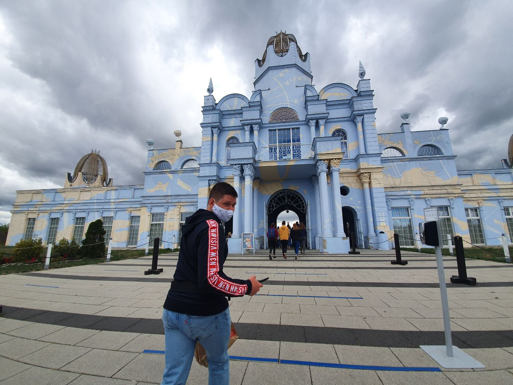

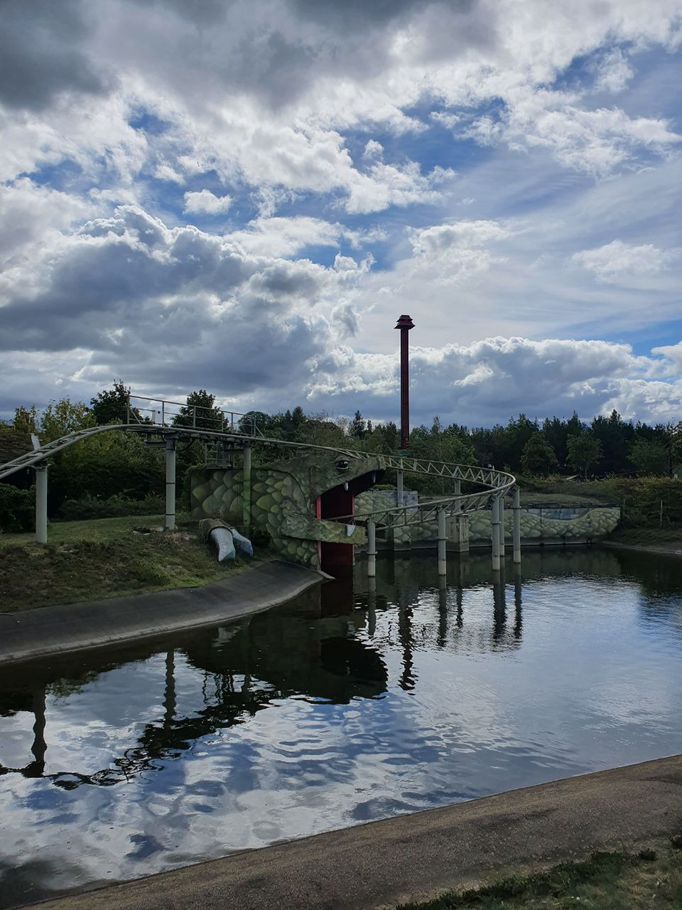

## Что покушать

**[Таверна аркади (Taverna Arkadi)][link_arkadi]** - это лучший ресторан Георгиоуполиса,
официально заявляю. Вид просто отменный, еда очень вкусная, порции добротные, свежие
морепродукты, ценник средний. Обязательно к посещению.

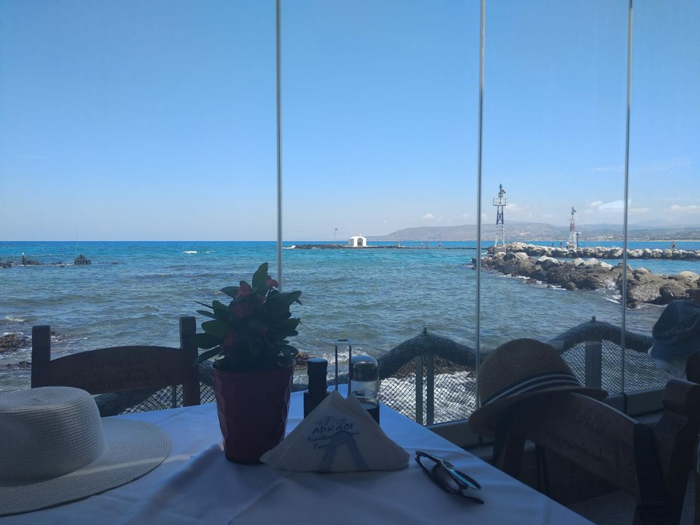

**[Джирополис (Gyropolis)][link_gyropolis]** - это небольшая забегаловка на
центральной площади. Примечательна она тем, что это типичный представитель греческого фастфуда.
Есть такое блюдо, которое можно коротко описать как "греческая шаурма", называется оно Gyros.
В этой забегаловке довольно вкусно можно поесть этого блюда, вместе с греческим салатом.
Попробовать стоит. Еда очень простая и вкусная (фастфуд), цены очень низкие. Опционально к посещению.

**[Ресторан отеля зорбас (Taverna Zorbas)][link_zorbas]** - да, мы ели здесь каждый день,
но блюда отменные! Плюс ценник вполне приличный, приветливый персонал.

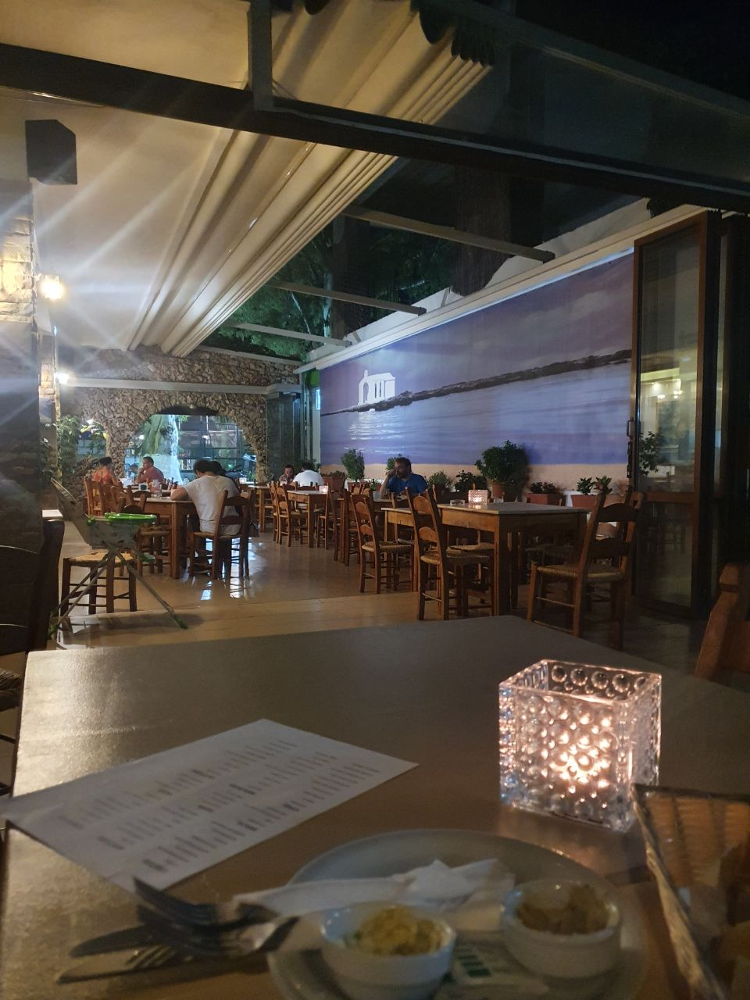

**[Sun Light Taverna][link_sun_light_taverna]** - если после купания в море хочется
побыстрее перекусить, а идти до [Аркади][link_arkadi] не охота, то можно зайти
в это место и поесть морепродуктов. Хороший сервис, вкусные морепродукты. Я
посоветовал бы октопуса и жаренных кальмаров.

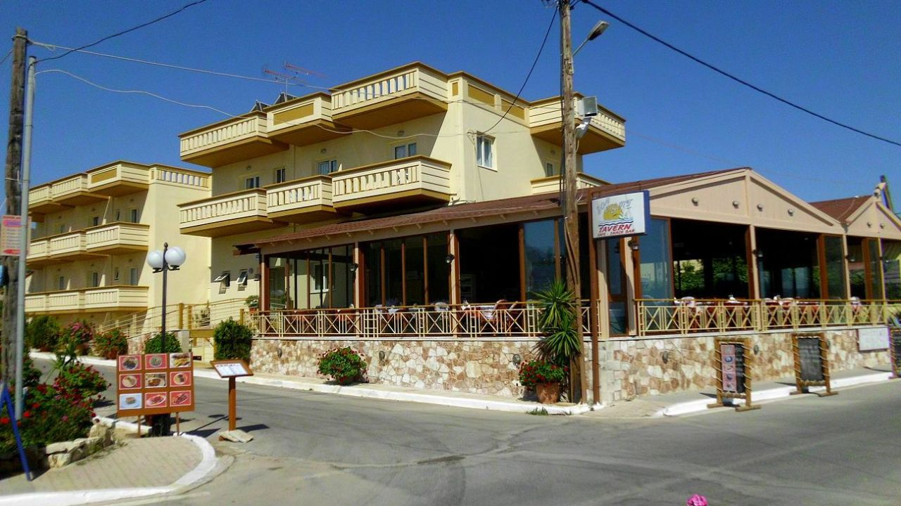

## Уроки

- **Покрывать 100% тела кремом от загара** - помазался кремом от загара, но все равно
  умудрился обгореть. Просто не помазал ноги. Дурак. Пару дней было больно ходить,
  пришлось использовать пантенол, потом прошло конечно же, но осадочек остался.
- **Рассчитывать количество крема от загара** - взяли слишком мало (один тюбик),
  пришлось докупать на месте, а на месте он нифига не дешовый (14.50 евро, карл).
- **Не разнашивать новую обувь за день до отпуска** - Люба купила босоножки и поносила
  их ровно один раз до поездки и натерла мозоль. Новые босоножки она в поездке не надевала.

> 29.08.2020

<!-- ссылки -->
[link_valeria]: https://atlas-tour.de/

[link_zorbas]: https://www.holidaycheck.de/hi/hotel-zorbas/f50e7028-12f3-3614-9074-3268e38f559c
[link_zorbas_location]: https://goo.gl/maps/fcjevpc424z867mw9
[link_main_beach]: https://maps.app.goo.gl/JDST2W9Wyvuz2yb78
[link_west_beach]: https://maps.app.goo.gl/DaM2JjvpNTf8skyQ6
[link_east_beach]: https://maps.app.goo.gl/JaGZCk9Pvv1N8miAA

[link_church_georgioupoli]: https://maps.app.goo.gl/3cnNmQamajkuhXbaA
[link_katamorani]: https://goo.gl/maps/KKBc7gPNCbSKFaJp8
[link_safari]: https://maps.app.goo.gl/DctfMmitstXnwRc97
[link_safari_church]: https://maps.app.goo.gl/VKz6DEvsoJRszFUq7
[link_minigolf]: https://goo.gl/maps/iNGbri5kDLhUBR6r6
[link_concerts]: https://goo.gl/maps/pdUFKrAi6ZHb1srM6

[link_church_retimno]: https://maps.app.goo.gl/kutRu3J1ounEdNPLA
[link_castle_retimno]: https://maps.app.goo.gl/PWLM2h1cK2C8kMzs8
[link_irish_pub]: https://maps.app.goo.gl/hM4MqynLue1g8jVK7

[link_belantis]: https://www.belantis.de
[link_belantis_location]: https://goo.gl/maps/fyqbJ8qLTFBmeSHg7

[link_arkadi]: https://g.page/arkadi-fish-taverna-georgioupo?share
[link_gyropolis]: https://goo.gl/maps/RmLRSSdVCGDDQynPA
[link_sun_light_taverna]: https://maps.app.goo.gl/5ezgiJhGppy8ryTs5
